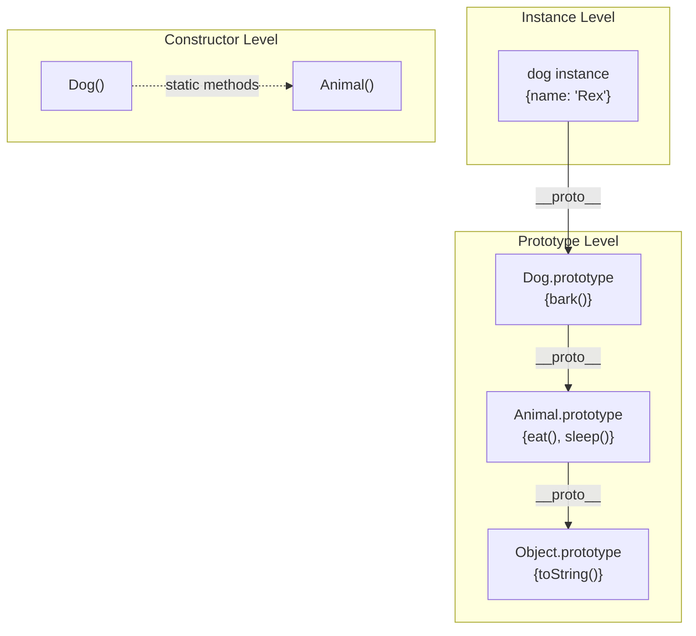
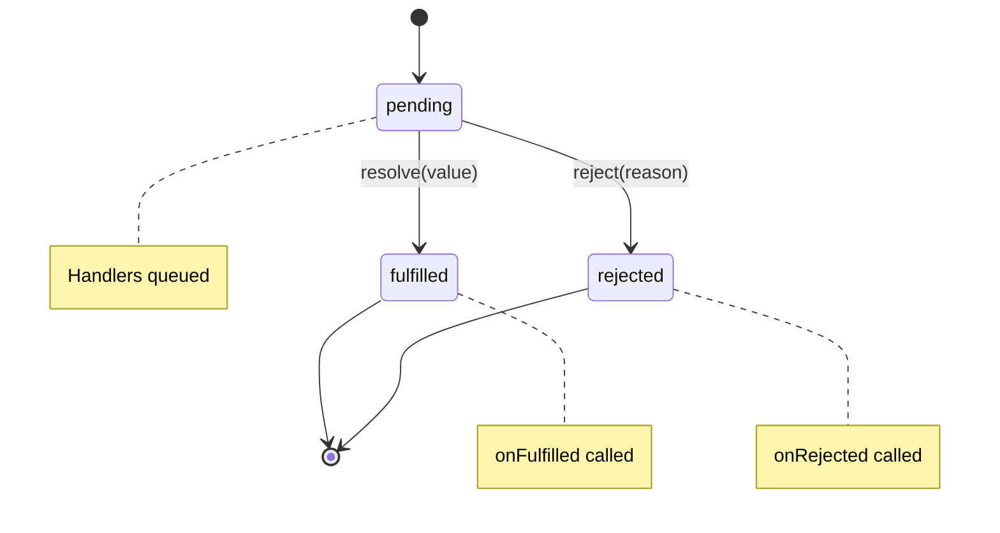
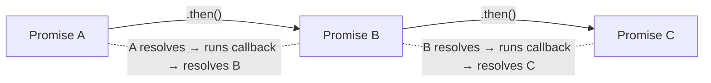
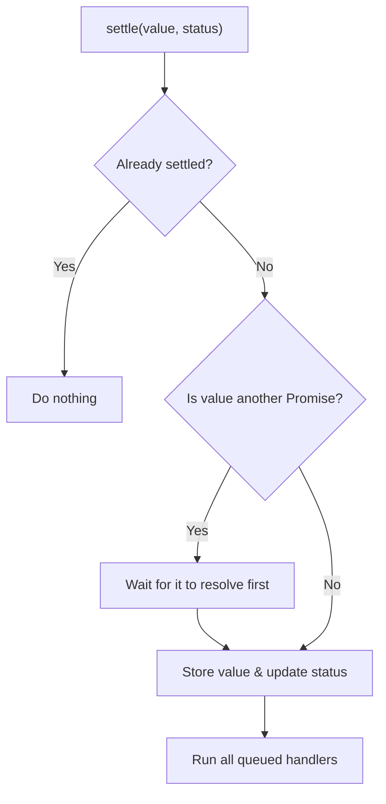
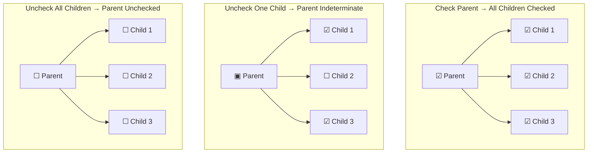
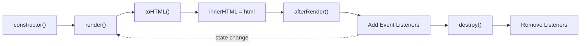

# Frontend Interview Preparation Workshop - Presentation Plan

## 2-Week Preparation Timeline

**Start Date:** February 4, 2026  
**Deadline:** February 18, 2026

---

## Slide Sections Overview

### 1. Introduction (Who Am I)

### 2. General Understanding of Frontend Interview Preparation

### 3. How the Course is Structured

### 4. How to Follow the Course

### 5. Part 1 - Basic JS Questions

### 6. Part 2 - Components

---

## Week 1 (Feb 4 - Feb 10)

### Day 1-2: Introduction & Course Overview Slides

- [ ] Write "Who Am I" section content
- [ ] Prepare personal background and experience highlights
- [ ] Create "General understanding of frontend interview preparation" content
- [ ] Research and include industry statistics/trends

### Day 3-4: Course Structure Slides

- [ ] Write "How the course is structured" section
- [ ] Create visual diagram of course flow
- [ ] Write "How to follow the course" guidelines
- [ ] Add tips for maximizing learning

### Day 5-7: Part 1 - Basic JS Questions

- [ ] Prepare slides for "Solving common JavaScript problems"
- [ ] Create ES5 Inheritance examples and explanations
- [ ] Document Custom Promise Implementation walkthrough
- [ ] Add code snippets and visual explanations

---

## Week 2 (Feb 11 - Feb 17)

### Day 8-10: Part 2 - Day 1 Components

- [ ] Create slides for Accordion, Star Rating, Tabs
- [ ] Document Tooltip, Dialog, Table components
- [ ] Prepare Reddit Thread, Gallery slides
- [ ] Add Nested Checkboxes, Toast component explanations

### Day 11-13: Part 2 - Day 2 Components

- [ ] Calculator, Square Game, Typeahead slides
- [ ] Heatmap, Progress Bar, Upload Component slides
- [ ] Portfolio Visualizer, Markdown Editor content
- [ ] GPT Chat Interface, Infinite Canvas slides
- [ ] Google Sheets Clone breakdown (Parser, Topo Sort, Engine, UX)

### Day 14: Final Review

- [ ] Final review and polish all sections
- [ ] Practice run-through

---

## Workshop Agenda (Reference)

### Day 1

| Time     | Topic                                                |
| -------- | ---------------------------------------------------- |
| 9:30 AM  | Introduction                                         |
| 9:45 AM  | Solving common JavaScript problems                   |
| 11:15 AM | ES5 Inheritance and Custom Promise Implementation    |
| 12:30 PM | Lunch Break                                          |
| 1:30 PM  | Accordion, Star Rating, Tabs, Tooltip, Dialog, Table |
| 3:15 PM  | Reddit Thread, Gallery, Nested Checkboxes, Toast     |
| 5:00 PM  | Day 1 Wrap Up                                        |

### Day 2

| Time     | Topic                                                                       |
| -------- | --------------------------------------------------------------------------- |
| 9:30 AM  | Advanced Components                                                         |
| 9:45 AM  | Calculator, Square Game, Typeahead, Heatmap, Progress Bar, Upload Component |
| 11:15 AM | Portfolio Visualizer, Markdown Editor                                       |
| 12:30 PM | Lunch Break                                                                 |
| 1:30 PM  | GPT Chat Interface, Infinite Figma-like Canvas                              |
| 3:15 PM  | Google Sheets Clone (Parser, Topo Sort, Engine, UX)                         |
| 4:30 PM  | Wrap Up & Q&A                                                               |
| 5:30 PM  | Day 2 Wrap Up                                                               |

---

## Slide Content Sections

### Slide 1: Introduction

Hi everyone, welcome to the Frontend Interview Preparation Workshop. Before we jump into the course, let's start
with a bit of introduction. My name is Evgenii, I work as a Staff UI Engineer at Meta. I've been working as a UI engineer for the last 10 years and I really love Frontend / UI development in general. It's such a fast-paced environment. In the last couple of years I've done a lot of UI interviews and I've definitely seen how the interview process has evolved,
especially in the last year with a rise of AI tooling and stressful economic environment.

What I definitely see now - interviews have become more demanding in general. In the past, you could get away with a good
knowledge of JavaScript and some UI framework or library. Now, the situation is different. You're often asked to build
components from scratch, interviews have become longer and more complex in terms of the things you write.

For me personally, coding is the most stressful part of the interview process. I'll be honest, I'm naturally bad at coding interviews and I think many people can relate to that. The reason for that is when you are under the time pressure, you often can forget even simple things and just stuck on simple problems. Happen to me many times :)

And for me - the main thing that works - is to practice, practice, and practice.

### Slide 2: What this course is about

So this course is about learning through practice by solving non-trivial problems. I want you to learn from my mistakes from my own experience and I hope it will help you to get more confident at frontend interviews

### Slide 3: Typical frontend interview structure

Let's first understand the typical frontend interview process that companies use right now

**1. Coding interview** - typically, you'll have 3-6 coding interviews in total, depending on the company. But the most often
setup is the following:

- 1-2 interviews on basic JS questions / Vanilla coding
- 2-3 interviews where you build some features / components either in Vanilla JS or using a library
- 2 interviews that test your Algo / DS skills
- Some companies, ask TypeScript questions during coding interview

**2. System Design** - if you're interviewing for a middle-senior role, you typically have 1 system design interview.
Staff+ engineers usually have 2 system design interviews.

**3. Behavioral interview** - Standard interview where they ask you about your past experience, how you handled certain situations. Basically company tries to understand if you're a good fit for their culture and if you have good communication and conflict resolution skills.

### Slide 4: What are we focusing on in this course

In this course, we'll mostly focus on Components / E2E features coding interviews - as I find it as the the most challeging for engineers. We'll pay less attention to basic JS questions - the reason for it is that you can easily find many resources online to prepare for them. In the course resources I'll attach some free platforms to practice.

For System Design Foundation knowledge - I do recommend checking out my course on Frontend Masters and also my YouTube channel where I have a lot of videos on Frontend System Design.

### Slide 5: Course Plan

**1. Basic JS Questions**

- Detect Type, Debounce, Throttle
- ES5 Inheritance
- Deep Equals, Deep Clone, Stringify
- Custom Promise Implementation
- Tree Select

**2. Components - Day 1**

- Accordion, Star Rating, Tabs
- Tooltip, Dialog, Table
- Reddit Thread, Gallery
- Nested Checkboxes, Toast

**3. Components - Day 2**

- Calculator, Square Game
- Typeahead (Autocomplete)
- Heatmap (Canvas)
- Progress Bar, File Upload
- Portfolio Visualizer
- Markdown Editor

**4. Advanced Components**

- GPT Chat Interface (Streaming)
- Infinite Figma-like Canvas
- Google Sheets Clone
  - Parser & Tokenizer
  - Topological Sorting
  - Table Engine
  - UX / UI

**5. TypeScript Type Challenges** (interleaved throughout the course)

- Challenges are spread across all sections
- Every 2 core problems are followed by 2 type challenges
- Covers: Basics, Mapped Types, Conditional Types, Infer, Template Literals, Recursion, Distributive, Advanced Patterns, Expert Techniques

### Slide 6: Difficulty of the questions

The problems in this workshop are intentionally **slightly harder than real interview questions**.

**The idea is simple:** If you train on harder problems, real interviews will feel calmer and more manageable.

**Problems are grouped into the following difficulty levels:**

1. **Warm-up** - Very basic problems that you should solve quickly. Expected time: **2–4 minutes**.
2. **Easy** - Small 5–10 minute problems. Some companies may give **3–4 easy problems in a 45-minute screening interview**.
3. **Medium** - **15–20 minute** problems. The majority of frontend interview questions fall into this category.
4. **Hard** - **45+ minute** problems that require practice and familiarity with specific browser APIs. During the workshop, we will aim to solve them in **20–25 minutes** to save time, but in real interviews, you would typically spend **45–60 minutes**.
5. **Extreme** - **1–2 hour** end-to-end problems. These usually involve building a **minimal version of a real product feature from scratch**. You may be provided with a mock server or API, and the focus shifts heavily toward **architecture and structure**. Typically asked on the staff level interviews.

We'll scale the difficulty of the problems during the course. We'll start from warm-up problems and gradually move to more complex ones.

### Slide 7: **Finding Solutions**

All problem solutions are included in the course materials and supporting github repo. However, I strongly encourage you to **re-implement the solutions yourself after finishing the course**. That is where the real learning happens.

### Slide 8: **How to follow the course**

1. IDE Setup: VSCode or WebStorm or any other IDE you are comfortable with.
2. Disable AI assistants and autocompletions: you're here to practice and learn, not to get the solution from AI.
3. Mistakes are inevitable. During the course, we'll most likely need to debug the code
4. Only Necessary CSS. We'll not waste precious time on styling the components. The focus will be on logic and structure

### Slide 10: Github Repo structure

The repository is organized to separate your working area from the reference solutions:

**1. Problems Folder** (`src/problems/`)
Each problem (e.g. `21-accordion`) acts as a self-contained unit:

- **Student Starter Files:**
  - `<name>.react.tsx` (React) or `<name>.vanila.ts` (Vanilla TS)
  - `<name>.module.css` (Styles)
  - _These are the empty files you will work on._
- **Reference Solution:**
  - The `solution/` subfolder contains the full working implementation.
  - Check this only if you are stuck or for comparison after finishing.
- **Component Harness:**
  - `<name>.example.tsx` connects both your implementation and the reference solution to the dashboard.

**2. Shared Utilities**

- **Abstract Component:** Vanilla components extend `AbstractComponent` (`src/problems/18-abstract-component/`) which enforces a standard `render()/destroy()` lifecycle.
- **Path Aliases:** configured in `tsconfig.json` to simplify imports:
  - `@course/styles` → `src/utilities/styles.module.css` (Shared utility classes)
  - `@course/cx` → `src/utilities/utility.ts` (Classname concatenation helper)
  - `@course/types` → `src/utilities/types.ts` (Shared types)
- **Global Styles:** `src/reset.css` and `src/app.module.css` handle baseline styling.

### Slide 11: Example of using utility css classes

We use a helper `cx` and a shared `flex` object to compose classes efficiently:

```tsx
import css from './card.module.css'
import flex from '@course/styles' // Shared utility classes
import cx from '@course/cx' // Classname composition helper

export const UserCard = ({ name, role }) => {
  return (
    <div className={cx(css.card, flex.flexRowBetween, flex.itemsCenter, flex.padding16)}>
      <div className={cx(flex.flexRowStart, flex.flexGap12, flex.itemsCenter)}>
        <Avatar />
        <div className={flex.flexColumnGap4}>
          <span className={css.name}>{name}</span>
          <span className={css.role}>{role}</span>
        </div>
      </div>

      <Button className={flex.marginLeft16}>Edit</Button>
    </div>
  )
}
```

### Slide 12: Part 1: Classic Vanilla Problems

As I mentioned earlier, we'll start from warm-up problems. We'll not spend too much time on them. But it doesn't mean that
this will be super easy. Before we jump into the problem, let's discuss the general approach on how to solve such problems on the interview

### Slide 13: Guidelines for solving vanilla problems

Typical coding interview lasts about 40-60 minutes, where you're asked to solve 1-3 problems depending on the difficulty.
It's absolutely important to approach the problem systematically and have a general plan. Overall, the approach is very similar
as how you solve DSA problems.

**Here is a general plan:**

1. Read the problem carefully and understand the requirements. (2-3 minutes)
2. Identify the inputs and outputs. (1-2 minutes)
3. Propose the approach and potential solution to the interview
   3.1. If you have multiple approaches, discuss them and choose the best one
   3.2. Discuss the time and space complexity of your solution (if applicable)
4. Implement your solution. (10-20 minutes)
5. Test your solution and handle edge cases. (5 minutes)
6. If you have time, optimize your solution. (5 minutes)

We're going to use this plan for all our vanilla problems.

// stopped here

### Slide 14: Detect-type

**Goal**: Implement a function `detectType(value)` that returns the type of any JavaScript value (returns `TType` union).

**Why not just use `typeof`?**

- `typeof null` returns `"object"` (historical bug)
- `typeof []` returns `"object"` (cannot distinguish from plain objects)
- It can't distinguish between specific built-in types (Date, RegExp, Map)

**Requirements**:

1. Return `"null"` for `null` and `"undefined"` for `undefined`.
2. For everything else, return the constructor name in lowercase (e.g., `Date` -> `"date"`).

### Slide 15: Solving Detect-type

**1. Inputs & Outputs**:

- Input: `any` JS value
- Output: `lowercase string` representing the specific type

**2. Approach**:
This specific problem tests how well you know the JavaScript language and its built-in fields.
The most straight forward approach is to use the `typeof` operator in combination with `instanceof` operator.

Here how it could look like:

```typescript
const detectType = (value: any) => {
  if (value === null) return 'null'

  if (typeof value === 'object') {
    if (value instanceof Date) return 'date'
    if (value instanceof Map) return 'map'
    if (Array.isArray(value)) return 'array'
    // ... check for other types
    return 'object'
  }

  return typeof value
}
```

**3. Optimization**:
Although this might work, it creates a lot of boilerplate code. I think we can do better.
Let's think about the properties of objects in JavaScript. We know that every object has a prototype, which is a reference to another object.
We also know that there is a constructor function associated with each object. And the constructor function has a name property, which is the name of the constructor function - which actually represents the type of the object.

**Property Diagram — How `Object.getPrototypeOf(value).constructor.name` works:**

```
  value              getPrototypeOf(value)         .constructor           .name
  ─────              ─────────────────────         ────────────           ─────
  [1, 2, 3]    ───►  Array.prototype         ───►  Array           ───►  "Array"
  new Date()   ───►  Date.prototype          ───►  Date            ───►  "Date"
  42           ───►  Number.prototype         ───►  Number          ───►  "Number"
  "hello"      ───►  String.prototype         ───►  String          ───►  "String"
  true         ───►  Boolean.prototype        ───►  Boolean         ───►  "Boolean"
  /regex/      ───►  RegExp.prototype         ───►  RegExp          ───►  "RegExp"
  new Map()    ───►  Map.prototype            ───►  Map             ───►  "Map"
  { a: 1 }     ───►  Object.prototype         ───►  Object          ───►  "Object"

  Then just .toLowerCase() → "array", "date", "number", "string", ...
```

So we can solve it by doing the following:

**4. Implementation**:

```typescript
export const detectType = (value: any): TType => {
  if (value == null) {
    return `${value}`
  }
  return (Object.getPrototypeOf(value)?.constructor?.name ?? 'object').toLowerCase()
}
```

**5. Verification**:
Let's run the test to see if it works. Here it is, all tests passed! And it took us only 3 lines of code. And it's also a very useful
utility to use in your production code. Let's jump to the next problem

### Slide 16: Debounce

**Goal**: Implement `debounce(fn, delay)` to ensure a function is only executed after `delay` milliseconds have passed since the last call.

**Why?**

- Search bars: Don't search on every keystroke, wait until user stops typing.
- Window resizing: Lay out page only once resize is done.
- Save buttons: Prevent accidental double submissions.

**Requirements**:

1. Return a function that delays execution.
2. If called again within `delay`, reset the timer.
3. Pass arguments (`...args`) and context (`this`) correctly.

### Slide 17: Solving Debounce

**1. Inputs & Outputs**:

- Input: Function `fn`, number `delay`
- Output: Debounced function

**2. Approach**:

- We need to "cancel" the previous scheduled execution if a new call happens.
- `setTimeout` returns a `timerId`.
- `clearTimeout(timerId)` cancels it.
- So, on every call: clear previous timer -> start new timer.

**3. Implementation**:

```typescript
export function debounce<T extends (...args: any[]) => any>(
  fn: T,
  delay: number,
): (...args: Parameters<T>) => void {
  let timerId: Timer | null = null

  return function (this: any, ...args: any[]) {
    // 1. Clear existing timer
    if (timerId) clearTimeout(timerId)

    // 2. Schedule new execution
    timerId = setTimeout(() => {
      fn.apply(this, args)
    }, delay)
  }
}
```

**4. Verification**:

- Fast typing "hello" -> 5 calls -> 4 clears -> 1 execution. Correct.

### Slide 18: TypeScript Challenge Break — Level 1 — Basics

Alright, it's time for a short TypeScript challenge break! Let's practice some type-level programming before we move on to the next problem.

### Slide 19: 1.1 Tuple Length

Given a tuple, create a generic `Length` that picks the length as a **specific number literal**.

```typescript
type Length<T extends readonly any[]> = T['length']
```

```typescript
type tesla = ['tesla', 'model 3', 'model X', 'model Y']
type L = Length<tesla> // 4  (not just `number`)
```

**Key insight:** `readonly any[]` accepts both mutable and readonly tuples. The `'length'` property on a tuple is a literal number, not just `number`.

---

### Slide 20: 1.2 First of Array

Extract the first element of a tuple type.

```typescript
type First<T extends any[]> = T extends [infer F, ...any[]] ? F : never
```

```typescript
type A = First<[3, 2, 1]> // 3
type B = First<[]> // never
```

**Key insight:** `infer` + variadic tuple destructuring (`...`) lets you pattern-match tuple shapes at the type level.

---

### Slide 21: 1.3 Tuple to Union

Convert a tuple's element types into a union.

```typescript
type TupleToUnion<T extends readonly any[]> = T[number]
```

```typescript
type R = TupleToUnion<[123, '456', true]> // 123 | '456' | true
```

**Key insight:** Indexing a tuple with `number` produces a union of all element types.

---

### Slide 22: Throttle

**Goal**: Implement `throttle(fn, delay)` to ensure a function executes at most _once_ every `delay` milliseconds.

**Why?**

- Scroll listeners: Check scroll position only every 100ms, not every pixel.
- Gaming: Limit fire rate regardless of how fast usage clicks.

**Requirements**:

1. Execute immediately if enough time has passed.
2. If called too frequently, ignore calls until cooldown expires.

### Slide 23: Solving Throttle (Basic)

**1. Inputs & Outputs**:

- Input: Function `fn`, number `delay`
- Output: Throttled function

**2. Approach**:

- We need to track the `lastTime` the function ran.
- On call: `now - lastTime` >= `delay`?I
  - Yes: Run function, update `lastTime`.
  - No: Do nothing (drop the call).

**3. Implementation**:

```typescript
export function throttle<T extends (...args: any[]) => any>(
  fn: T,
  delay: number,
): (...args: Parameters<T>) => void {
  let lastTime = 0

  return function (this: any, ...args: any[]) {
    const now = Date.now()

    // Check if cooldown has passed
    if (now - lastTime >= delay) {
      fn.apply(this, args)
      lastTime = now
    }
  }
}
```

**4. Verification**:

- Scroll for 500ms with 100ms throttle -> Runs at 0ms, 100ms, 200ms...
- Dropped intermediate calls. Correct.

### Slide 24: ES5 Extends

**Goal**: Implement a `myExtends(SuperType, SubType)` function that mimics ES5 prototype-based inheritance — combining two constructor functions into one that inherits both instance properties and prototype methods.

**Why?**

- Understanding the prototype chain is fundamental to JS.
- Modern `class` syntax is just syntactic sugar over this.

**Requirements**:

1. The returned constructor must call both `SuperType` and `SubType` constructors (Constructor Stealing).
2. Instances must have access to methods from both `SuperType.prototype` and `SubType.prototype` (Prototype Chain).
3. Static methods from `SuperType` should be inherited by the returned constructor (Static Inheritance).

**Prototype Chain Visualization**:



### Slide 25: Example Usage of myExtends

Let's see how our `myExtends` function would be used in a real-world scenario to simulate inheritance.

```javascript
// Base constructor
function Animal(name) {
  this.name = name
}
Animal.prototype.eat = function () {
  console.log(this.name + ' is eating')
}

// Sub constructor
function Dog(name, breed) {
  this.breed = breed
}
Dog.prototype.bark = function () {
  console.log(this.name + ' says Woof!')
}

// Create the inherited constructor
const MyDog = myExtends(Animal, Dog)

const rex = new MyDog('Rex', 'German Shepherd')

rex.eat() // "Rex is eating" (from Animal)
rex.bark() // "Rex says Woof!" (from Dog)
console.log(rex.breed) // "German Shepherd"
```

### Slide 26: Solving ES5 Extends

**1. Approach**:

- **Instances**: `Dog.prototype` should inherit from `Animal.prototype`.
  - `Dog.prototype = Object.create(Animal.prototype)`
- **Constructor**: Call `Animal.call(this)` inside `Dog` constructor.
- **Statics**: `Dog.__proto__ = Animal`.

**2. Implementation**:

```typescript
function myExtends(SuperType, SubType) {
  function Extended(...args) {
    // 1. Constructor Stealing
    SuperType.apply(this, args)
    SubType.apply(this, args)
  }

  // 2. Prototype Inheritance
  // Don't modify SubType.prototype directly or you lose its methods!
  // Instead, create a chain.
  Extended.prototype = Object.create(SuperType.prototype)
  Object.assign(Extended.prototype, SubType.prototype)

  // 3. Fix Constructor Link
  Extended.prototype.constructor = Extended

  // 4. Static Inheritance
  Object.setPrototypeOf(Extended, SuperType)

  return Extended
}
```

_Note: This is a simplified educational version. Real polyfills are more complex._

### Slide 27: TypeScript Challenge Break — Level 1 & 2 — Basics & Mapped Types

Alright, it's time for a short TypeScript challenge break! Let's practice some type-level programming before we move on to the next problem.

### Slide 28: Level 2 — Mapped Types

**Concepts:** `{ [P in K]: ... }`, `keyof`, property modifiers (`readonly`, `?`), key remapping via `as`.

```typescript
// The general pattern
type MappedType<T> = {
  [P in keyof T]: T[P] // iterates over every property
}
```

Mapped types that iterate over `keyof T` are **homomorphic** — they preserve modifiers by default.

---

### Slide 29: 2.1 Pick

Construct a type by picking properties `K` from `T` (re-implement `Pick`).

```typescript
type MyPick<T, K extends keyof T> = {
  [P in K]: T[P]
}
```

**Key insight:** `K extends keyof T` constrains the keys; `[P in K]` iterates only the selected keys.

---

### Slide 30: 2.2 Readonly

Make all properties of `T` readonly (re-implement `Readonly`).

```typescript
type MyReadonly<T> = {
  readonly [P in keyof T]: T[P]
}
```

**Key insight:** Adding `readonly` before the property in a mapped type makes every property immutable.

---

### Slide 31: Deep Equals

Deep equals is actually a classic JS interview problem. It's not specifically complex
but has some interesting edge cases related to circular reference handling. Let's use
our structured plan to solve this problem.

**Goal**: Implement `deepEquals(a, b)` to check if two values are structurally identical.

**Why?**

- React: Should I re-render? (Props comparison)
- Testing: `expect(obj).toEqual(expected)`
- State Management: Did state actually change?

**Requirements**:

1. Primitives: Strict equality `===` (but handle `NaN`).
2. Objects/Arrays: Compare keys and values recursively.
3. No type coercion (`"1" !== 1`).
4. Handle circular references (optional but good).

**How circular references break recursive functions:**

A circular reference is when an object refers back to itself (directly or indirectly).
Without detection, our recursive function will follow the cycle forever and crash:

```
  Setup:
    const a = { name: "Alice" }
    a.self = a                    // circular reference!

    const b = { name: "Alice" }
    b.self = b                    // same structure, also circular

  Object graph (both a and b look like this):
    ┌──────────────────┐
    │  obj              │
    │  ├─ name: "Alice" │
    │  └─ self: ───────┼──┐
    └──────────────────┘  │
         ▲                │
         └────────────────┘  (points back to itself)

  What happens when deepEquals(a, b) recurses without cycle detection:

    deepEquals(a, b)
      └─ key "name" → "Alice" === "Alice" ✓
      └─ key "self" → deepEquals(a.self, b.self)   // a.self IS a, b.self IS b
                        └─ key "name" ✓
                        └─ key "self" → deepEquals(a.self.self, b.self.self)
                                          └─ key "name" ✓
                                          └─ key "self" → deepEquals(...)
                                                           └─ ... ♾️ infinite
                                                           └─ 💥 RangeError: Maximum call stack size exceeded

  Fix: Use a Map to track visited pairs. If we've seen (a, b) before → return true.
```

**How a Map (cache) solves it:**

```
  cache = Map<object, object>

  Call 1: deepEquals(a, b, cache)
  │  cache.has(a)?  → NO
  │  cache.set(a, b)          cache: { a → b }
  │  compare key "name" ✅
  │  compare key "self" → recurse...
  │
  └──► Call 2: deepEquals(a.self, b.self, cache)   // a.self IS a, b.self IS b
       │  cache.has(a)?  → YES, cache.get(a) === b? → YES ✅
       │  return true     ⛔ cycle broken, no more recursion
```

### Slide 32: Solving Deep Equals

**1. Inputs & Outputs**:

- Input: Two values `a` and `b` (any type).
- Output: `boolean`.

**2. Approach**:

- **Base Case**: If `a === b` return `true`.
- **Type Check**: If `typeof` differs or one is null, return `false`.
- **Recursion**:
  - If Array: Compare length, then each item.
  - If Object: Compare keys length, keys existence, then each value.
- **Cycle Detection**: Use a `Map<ver, ver>` or `weakMap` to track visited pairs.

**3. Implementation (Simplified)**:

```typescript
function deepEquals(a: any, b: any): boolean {
  if (a === b) return true

  if (typeof a !== 'object' || a === null || typeof b !== 'object' || b === null) {
    return false
  }

  const keysA = Object.keys(a)
  const keysB = Object.keys(b)

  if (keysA.length !== keysB.length) return false

  for (const key of keysA) {
    if (!keysB.includes(key) || !deepEquals(a[key], b[key])) {
      return false
    }
  }

  return true
}
```

_Note: Real implementation handles circular refs and special types (Date/RegExp)._

### Slide 33: Deep Clone

**Goal**: Implement `deepClone(value)` to create an independent copy of a value.

**Why?**

- Redux/State: Never mutate state directly. Clone, modify, return new state.
- undo/redo history.
- Preventing side effects when passing objects to functions.

**Requirements**:

1. Primitives: Return as-is.
2. Objects/Arrays: New instances with cloned children.
3. Special Types: Map, Set, Date, RegExp.
4. Circular References: **Critical** here, or you get stack overflow.

### Slide 34: Solving Deep Clone

**1. Approach**:

- **Recursion**: Essential for nested structures.
- **Circular Handling**: We MUST use a cache `Map<Original, Clone>`.
  - Before cloning children, store `(original, newInstance)` in Map.
  - If we encounter `original` again, return `newInstance` from Map immediately.

**2. Implementation**:

```typescript
function deepClone<T>(value: T, cache = new Map()): T {
  // 1. Primitives & null
  if (typeof value !== 'object' || value === null) return value

  // 2. Circular Check
  if (cache.has(value)) return cache.get(value)

  // 3. Handle Array
  if (Array.isArray(value)) {
    const arr: any = []
    cache.set(value, arr) // Store before recursion
    value.forEach((item, i) => (arr[i] = deepClone(item, cache)))
    return arr as T
  }

  // 4. Handle Object
  const obj: any = {}
  cache.set(value, obj) // Store before recursion
  for (const key in value) {
    if (Object.prototype.hasOwnProperty.call(value, key)) {
      obj[key] = deepClone(value[key], cache)
    }
  }
  return obj as T
}
```

### Slide 35: TypeScript Challenge Break — Level 2 — Mapped Types (continued)

Alright, it's time for a short TypeScript challenge break! Let's practice some type-level programming before we move on to the next problem.

### Slide 36: 2.3 Tuple to Object

Transform a tuple of string/number/symbol values into an object type where each value becomes both key and value.

```typescript
type TupleToObject<T extends readonly (string | number | symbol)[]> = {
  [P in T[number]]: P
}
```

```typescript
type R = TupleToObject<['tesla', 'model 3']>
// { tesla: 'tesla'; 'model 3': 'model 3' }
```

---

### Slide 37: 2.4 Append to Object

Add a new field to an existing object type.

```typescript
type AppendToObject<T extends object, U extends string, V> = {
  [P in keyof T | U]: P extends keyof T ? T[P] : V
}
```

**Key insight:** `keyof T | U` creates the union of existing keys plus the new key. The conditional picks the right value type.

---

### Slide 38: Stringify

**Goal**: Implement `stringify(value)` (like `JSON.stringify`), but with circular reference support.
This is another classic DFS-like problem, similar to deep-equals. Once you're comfortable with
such problems, it shouldn't be a problem for you to solve them.

**Requirements**:

1. Formatting: `[1,2]` for arrays, `{a:1}` for objects.
2. Primitives: Strings have quotes `"hello"`.
3. Circular Refs: Return `"[Circular]"` instead of crashing.
4. Support types usually ignored by JSON: `undefined` should be stringified here (e.g., as `"undefined"` or similar per requirements).

### Slide 39: Solving Stringify

**1. Approach**:

- **Recursion**: Similar to deepClone.
- **Cache**: Needed for `[Circular]` detection.
- **Switch Case**: Handle every type (Date, Array, Object, etc.).

**2. Implementation**:

```typescript
function stringify(value: any, seen = new WeakSet()): string {
  // 1. Primitives
  if (value === null) return 'null'
  if (typeof value === 'string') return `"${value}"`
  if (typeof value !== 'object') return String(value)

  // 2. Circular Check
  if (seen.has(value)) return '"[Circular]"'
  seen.add(value)

  // 3. Collections
  if (Array.isArray(value)) {
    const items = value.map((v) => stringify(v, seen)).join(',')
    return `[${items}]`
  }

  // 4. Objects
  const entries = Object.entries(value).map(([k, v]) => `${k}:${stringify(v, seen)}`)
  return `{${entries.join(',')}}`
}
```

### Slide 40: Promise Polyfill

This is one of the hardest classic vanilla problems. Normally, in the interview, you're given
only a small subset of the problem to solve (like implementing parallel, sequence, or other utility methods). This, however, requires a full understanding of how the event loop / microtasks work
as well as how to chain promises correctly. Alright, let's dive into that, and as always use our
plan to tackle this problem.

**Goal**: Implement a `MyPromise` class compliant with usage (then/catch/resolve/reject).

**Difficulty**: Hard.

**Promise State Machine**:



**Requirements**:

1. Three States: `pending`, `fulfilled`, `rejected`.
2. Async Execution: Callbacks don't run immediately on resolve.
3. Chaining: `.then()` returns a NEW Promise.

### Slide 41: Promise - Step 1: Types & Constants

Let's build our Promise step by step, following the solution code. First, let's define the types we'll need:

```typescript
type PromiseStatus = 'pending' | 'fulfilled' | 'rejected'

const PENDING: PromiseStatus = 'pending'
const FULFILLED: PromiseStatus = 'fulfilled'
const REJECTED: PromiseStatus = 'rejected'

type Executor<T> = (
  resolve: (value: T | PromiseLike<T>) => void,
  reject: (reason?: any) => void,
) => void

type OnFulfilled<T, R> = ((value: T) => R | PromiseLike<R>) | undefined | null
type OnRejected<R> = ((reason: any) => R | PromiseLike<R>) | undefined | null

type Handler<T> = {
  onFulfilled: (value: T) => any
  onRejected: (reason: any) => any
  resolve: (value: any) => void
  reject: (reason: any) => void
}
```

**Key points**: We define status constants to avoid string typos. The `Handler` interface stores both callbacks AND the next promise's resolve/reject — this is how chaining works.

### Slide 42: Promise - Step 2: Class Skeleton

Now let's set up the class with its private fields:

```typescript
export class MyPromise<T = any> {
  #handlers: Handler<T>[] = []
  #status: PromiseStatus = PENDING
  #value: T | any
  #isResolved: boolean = false
}
```

### Slide 43: Promise - Step 3: The then() Method

`.then()` returns a NEW Promise — this is the heart of chaining:



```typescript
then<R = T>(onFulfilled?: OnFulfilled<T, R>, onRejected?: OnRejected<R>): MyPromise<R> {
  const handler: Handler<T> = {
    onFulfilled: typeof onFulfilled === 'function' ? onFulfilled : (v: T) => v as any,
    onRejected:
      typeof onRejected === 'function'
        ? onRejected
        : (err: any) => {
            throw err
          },
    resolve: () => {},
    reject: () => {},
  }

  const promise = new MyPromise<R>((res, rej) => {
    handler.resolve = res
    handler.reject = rej
  })

  this.#handlers.push(handler)

  if (this.#status !== PENDING) {
    this.#execute()
  }

  return promise
}
```

**Key details**:

- Default `onFulfilled` passes the value through (identity function)
- Default `onRejected` re-throws the error (error propagation)
- We capture `resolve`/`reject` of the **new** promise into the handler
- If already settled, execute immediately; otherwise handlers wait in queue

### Slide 44: Promise - Step 4: Handler Execution with Microtasks

When the promise settles, we need to run all queued handlers asynchronously:

```typescript
#execute = (): void => {
  const handlers = this.#handlers
  for (const { onFulfilled, onRejected, resolve, reject } of handlers) {
    const handler = this.#status === FULFILLED ? onFulfilled : onRejected
    queueMicrotask(() => {
      try {
        const result = handler(this.#value)
        if (result instanceof MyPromise) {
          result.then(resolve, reject)
        } else {
          resolve(result)
        }
      } catch (e) {
        reject(e)
      }
    })
  }
  this.#handlers = []
}
```

**Why `queueMicrotask`?** Promise callbacks must run asynchronously. Without it:

```typescript
const p = new MyPromise((resolve) => resolve(1))
p.then((v) => console.log(v))
console.log('sync')
// Without microtask: 1, sync  ❌
// With microtask:    sync, 1  ✅
```

**Why check `instanceof MyPromise`?** If a `.then()` callback returns a Promise, we must wait for it before resolving the next promise in the chain.

### Slide 45: Promise - Step 5: The #settle Method

The core state transition — a unified method for both resolve and reject:



```typescript
#settle = (v: T | any, status: PromiseStatus = FULFILLED): void => {
  if (this.#isResolved) return    // Can only settle ONCE
  this.#isResolved = true

  const update = (v: T | any): void => {
    this.#value = v
    this.#status = status
    this.#execute()               // Trigger queued handlers
  }

  // If resolving with another MyPromise, wait for it first
  if (v instanceof MyPromise && status === FULFILLED) {
    v.then(update)
  } else {
    update(v)
  }
}

#resolve = (v: T | PromiseLike<T>): void => void this.#settle(v, FULFILLED)
#reject = (e: any): void => void this.#settle(e, REJECTED)
```

### Slide 46: Promise - Step 6: Constructor

The constructor receives an executor and runs it immediately:

```typescript
constructor(executor: Executor<T>) {
  this.#status = PENDING
  this.#isResolved = false
  try {
    executor(this.#resolve, this.#reject)
  } catch (e) {
    this.#reject(e)
  }
}
```

**Note**: Since `#resolve` and `#reject` are arrow functions (not methods), they correctly capture `this` — no binding needed. If the executor throws synchronously, we catch it and reject.

### Slide 47: Promise - Step 7: catch() & Static Methods

These are simple shortcuts:

```typescript
catch<R = never>(onRejected?: OnRejected<R>): MyPromise<T | R> {
  return this.then<T | R>(undefined, onRejected)
}

static resolve<T>(value: T): MyPromise<T> {
  return new MyPromise<T>((res) => res(value))
}

static reject<T = never>(value: any): MyPromise<T> {
  return new MyPromise<T>((_, rej) => rej(value))
}
```

### Slide 48: Promise - Complete Implementation

Here's the full working Promise implementation. Let's verify it against the tests:

```typescript
type PromiseStatus = 'pending' | 'fulfilled' | 'rejected'

const PENDING: PromiseStatus = 'pending'
const FULFILLED: PromiseStatus = 'fulfilled'
const REJECTED: PromiseStatus = 'rejected'

type Executor<T> = (
  resolve: (value: T | PromiseLike<T>) => void,
  reject: (reason?: any) => void,
) => void

type OnFulfilled<T, R> = ((value: T) => R | PromiseLike<R>) | undefined | null
type OnRejected<R> = ((reason: any) => R | PromiseLike<R>) | undefined | null

interface Handler<T> {
  onFulfilled: (value: T) => any
  onRejected: (reason: any) => any
  resolve: (value: any) => void
  reject: (reason: any) => void
}

export class MyPromise<T = any> {
  #handlers: Handler<T>[] = []
  #status: PromiseStatus = PENDING
  #value: T | any
  #isResolved: boolean = false

  #settle = (v: T | any, status: PromiseStatus = FULFILLED): void => {
    if (this.#isResolved) return
    this.#isResolved = true
    const update = (v: T | any): void => {
      this.#value = v
      this.#status = status
      this.#execute()
    }
    if (v instanceof MyPromise && status === FULFILLED) {
      v.then(update)
    } else {
      update(v)
    }
  }

  #resolve = (v: T | PromiseLike<T>): void => void this.#settle(v, FULFILLED)
  #reject = (e: any): void => void this.#settle(e, REJECTED)

  #execute = (): void => {
    const handlers = this.#handlers
    for (const { onFulfilled, onRejected, resolve, reject } of handlers) {
      const handler = this.#status === FULFILLED ? onFulfilled : onRejected
      queueMicrotask(() => {
        try {
          const result = handler(this.#value)
          if (result instanceof MyPromise) {
            result.then(resolve, reject)
          } else {
            resolve(result)
          }
        } catch (e) {
          reject(e)
        }
      })
    }
    this.#handlers = []
  }

  constructor(executor: Executor<T>) {
    this.#status = PENDING
    this.#isResolved = false
    try {
      executor(this.#resolve, this.#reject)
    } catch (e) {
      this.#reject(e)
    }
  }

  then<R = T>(onFulfilled?: OnFulfilled<T, R>, onRejected?: OnRejected<R>): MyPromise<R> {
    const handler: Handler<T> = {
      onFulfilled: typeof onFulfilled === 'function' ? onFulfilled : (v: T) => v as any,
      onRejected:
        typeof onRejected === 'function'
          ? onRejected
          : (err: any) => {
              throw err
            },
      resolve: () => {},
      reject: () => {},
    }

    const promise = new MyPromise<R>((res, rej) => {
      handler.resolve = res
      handler.reject = rej
    })

    this.#handlers.push(handler)

    if (this.#status !== PENDING) {
      this.#execute()
    }

    return promise
  }

  catch<R = never>(onRejected?: OnRejected<R>): MyPromise<T | R> {
    return this.then<T | R>(undefined, onRejected)
  }

  static resolve<T>(value: T): MyPromise<T> {
    return new MyPromise<T>((res) => res(value))
  }

  static reject<T = never>(value: any): MyPromise<T> {
    return new MyPromise<T>((_, rej) => rej(value))
  }
}
```

### Slide 49: TypeScript Challenge Break — Level 2 — Mapped Types (continued)

Alright, it's time for a short TypeScript challenge break! Let's practice some type-level programming before we move on to the next problem.

### Slide 50: 2.5 Merge

Merge two types — keys from the second type override the first.

```typescript
type Merge<F, S> = {
  [P in keyof F | keyof S]: P extends keyof S ? S[P] : P extends keyof F ? F[P] : never
}
```

**Key insight:** Check `S` first (second type wins), then fall back to `F`.

---

### Slide 51: 2.6 Diff

Get properties that exist in one object but not the other.

```typescript
type Diff<O extends object, O1 extends object> = {
  [K in keyof (O & O1) as K extends keyof (O | O1) ? never : K]: (O & O1)[K]
}
```

**Key insight:** `keyof (O & O1)` = all keys from both; `keyof (O | O1)` = only shared keys. Filter via `as` to keep the difference.

---

### Slide 52: Tree Select

We're finishing with vanilla JS problems, so our last problem will be a kind of preface to one of the future problems with Nested checkboxes. The problem is called Tree Select, and the idea is to mimic the behavior of nested checkboxes / tree menu where
items and subitems can be selected / deselected or have
an indeterminate state.

**Goal**: Implement selection logic for a checkbox tree (Parent/Child relationship).

**Tree State Propagation**:



**Requirements**:

1. Check Parent -> Check all children.
2. Uncheck Parent -> Uncheck all children.
3. Check some children -> Parent becomes "Partial" (`[-]`).
4. Check all children -> Parent becomes "Checked" (`[v]`).

**Input**:

```typescript
// paths: defines tree structure
const paths = ['a/b/c', 'a/b/d', 'a/e']
// clicks: sequence of node clicks
const clicks = ['b'] // Selects b and all its children (c, d)
```

**Visual State Transitions**:

```
Initial:        Click "b":      Click only "c":
[ ]a            [o]a            [o]a
├─[ ]b          ├─[v]b          ├─[o]b
│  ├─[ ]c       │  ├─[v]c       │  ├─[v]c
│  └─[ ]d       │  └─[v]d       │  └─[ ]d
└─[ ]e          └─[ ]e          └─[ ]e
```

**Output Example**:

```typescript
// Output string:
// [o]a
// .[v]b
// ..[v]c
// ..[v]d
// .[ ]e
```

Dots represent nesting depth, brackets show status: `[v]` = selected, `[ ]` = not selected, `[o]` = partial (some children selected).

### Slide 53: Solving Tree Select

To solve this problem we actually need to remind ourselves about how bubbling works in the DOM, as it is
a key principle that we need to apply to solve this problem. Let's apply our structured approach to tackle this problem.

**1. Approach**:

**Event Bubbling Analogy**: Just like DOM events bubble UP from child to parent, our selection state must propagate UP the tree. When you click a checkbox:

- **Capture phase (Down)**: Selection flows DOWN to all descendants
- **Bubble phase (Up)**: Parent state is recalculated by looking at children's states

```
Click on "b":
                    ┌──────────────────┐
  3. Bubble UP      │   a (recalc)     │
         ▲          └────────┬─────────┘
         │                   │
         │          ┌────────▼─────────┐
  1. Set status     │   b ← CLICKED    │
         │          └────────┬─────────┘
         │                   │
         ▼          ┌────────▼─────────┐
 2. Propagate DOWN  │   c, d (set)     │
                    └──────────────────┘
```

- **Data Structure**: Map paths to Nodes `{'a/b': Node}`. Link Parent <-> Children.
- **Action**: `click(node)`.
- **Propagation**:
  1. **Down**: Set all descendants to new status.
  2. **Up**: Walk up to Root. Re-evaluate status based on children.
     - All children checked? -> Checked.
     - Any checked/partial? -> Partial.
     - None? -> Unchecked.

**2. Step-by-Step Implementation Plan**:

1. **Define `TreeNode` class** with `name`, `parent`, `children[]`, `status`:

```typescript
type SelectionStatus = 'v' | ' ' | 'o'
const SELECTED: SelectionStatus = 'v'
const NOT_SELECTED: SelectionStatus = ' '
const PARTIAL: SelectionStatus = 'o'

class TreeNode {
  children: TreeNode[] = []
  status: SelectionStatus = NOT_SELECTED

  constructor(
    public name: string,
    public parent: TreeNode | null,
  ) {}

  addChild(node: TreeNode): void {
    node.parent = this
    this.children.push(node)
  }

  updateStatus(): void {
    const selectedCount = this.children.reduce(
      (acc, node) => acc + (node.status === SELECTED ? 1 : 0),
      0,
    )
    const hasPartialChild = this.children.some((c) => c.status === PARTIAL)

    if (selectedCount === this.children.length && !hasPartialChild) {
      this.status = SELECTED
    } else if (selectedCount === 0 && !hasPartialChild) {
      this.status = NOT_SELECTED
    } else {
      this.status = PARTIAL
    }
  }
}
```

2. **Build the tree** — create root + `Map<name, TreeNode>` for quick lookup:

```typescript
function createTree(paths: string[]): [TreeNode, Map<string, TreeNode>] {
  const root = new TreeNode('', null)
  const store = new Map<string, TreeNode>()

  for (const path of paths) {
    let parent: TreeNode = root
    const tokens = path.split('/')

    for (const token of tokens) {
      let node = store.get(token)
      if (!node) {
        node = new TreeNode(token, parent)
        parent.addChild(node)
        store.set(token, node)
      }
      parent = node
    }
  }

  return [root, store]
}
```

3. **Create generator functions** — `bubble` goes UP, `propagate` goes DOWN:

```typescript
function* bubble(target: TreeNode): Generator<TreeNode> {
  if (target.parent != null) {
    yield target.parent
    yield* bubble(target.parent)
  }
}

function* propagate(target: TreeNode | null): Generator<TreeNode> {
  if (target == null) return
  for (const ch of target.children) {
    yield ch
    yield* propagate(ch)
  }
}
```

4. **Handle each click** — toggle, propagate down, bubble up (shown below in Key Implementation).

5. **Render** — convert tree to string with dots for depth:

```typescript
toString(level: number = -1): string {
  const dots = Math.max(0, level)
  const root = level === -1 ? '' : `${'.'.repeat(dots)}[${this.status}]${this.name}\n`
  return root.concat(this.children.map((n) => n.toString(level + 1)).join(''))
}
```

**3. Key Implementation**:

```typescript
// Toggle + Propagate Down + Bubble Up
for (const click of clicks) {
  const node = store.get(click)
  if (!node) continue

  // Toggle status
  node.status = node.status !== ' ' ? ' ' : 'v'

  // Propagate DOWN to all descendants
  for (const child of propagate(node)) {
    child.status = node.status
  }

  // Bubble UP to recalculate ancestors
  for (const parent of bubble(node)) {
    parent.updateStatus()
  }
}
```

### Slide 54: Congratulations - Part 1 Completed

You've successfully completed all the problems in this section! I think it's a good warm up for the next section where we will be dealing with more complex and interesting component problems.

Now, let's have a quick break and then we will move on to the next section.

### Slide 55: TypeScript Challenge Break — Level 2 & 3 — Mapped Types & Conditional Types

Alright, it's time for a short TypeScript challenge break! Let's practice some type-level programming before we move on to the next problem.

### Slide 56: Level 3 — Conditional Types

**Pattern:** `T extends U ? X : Y`

When `T` is a **naked type parameter** and receives a **union**, the conditional **distributes** over each member.

```typescript
type ToArray<T> = T extends any ? T[] : never
type R = ToArray<string | number> // string[] | number[]
```

---

### Slide 57: 3.1 If

A simple boolean conditional at the type level.

```typescript
type If<C extends boolean, T, F> = C extends true ? T : F
```

```typescript
type A = If<true, 'a', 'b'> // 'a'
type B = If<false, 'a', 'b'> // 'b'
```

---

### Slide 58: 3.3 IsNever

Detect if a type is `never`.

```typescript
type IsNever<T> = [T] extends [never] ? true : false
```

**Key insight:** Wrapping in a tuple `[T]` prevents distribution. A naked `T extends never` with `T = never` distributes over zero members and returns `never` (not `true`).

---

### Slide 59: Part 2: UI Components

Alright, in this section we will get a little more practical and we're going to build real world UI components from scratch and utilise common patterns. We're going to build components both in React and Vanilla. So you guys have a good understanding of how to build components with libraries and without them.

For components section, let's also have a structured plan of how to implement them. The requirements for components are a little bit different, for instance we don't need to handle Time complexity much or write E2E tests cases, so instead we'll focus on UI patterns.

**Here is the plan that we want to follow**:

| Step                  | Focus                                                                  |
| --------------------- | ---------------------------------------------------------------------- |
| 1. **Requirements**   | What does the component do? What are the user interactions?            |
| 2. **Data Model**     | What's the input/state shape?                                          |
| 3. **API Design**     | What props/methods does the component expose?                          |
| 4. **UI Patterns**    | Controlled vs Uncontrolled? Event delegation? State management?        |
| 5. **Accessibility**  | Semantic HTML, ARIA attributes, keyboard navigation                    |
| 6. **Minimal Styles** | Don't focus on the beauty of the component, focus on the functionality |

### Slide 60: Vanila problem solving / React problem solving

What's the difference between Vanilla and React problem solving? When you write a component using any library you already have some kind of a structure:

1. Render function (JSX)
2. State management (useState, useReducer)
3. Life-cycle methods / hooks (useEffect)

In Vanilla JS, we have tools, but not the structure. So, let me teach you how you can build any component on the interview using a simple class pattern.

### Slide 61: Introducing AbstractComponent

The idea is to create a base class that mimics React's component lifecycle. Every Vanilla component will extend this class.

**Core Concepts**:

| React            | AbstractComponent              |
| ---------------- | ------------------------------ |
| `render()` + JSX | `toHTML()` returns HTML string |
| `useState`       | Class properties + `render()`  |
| `useEffect`      | `afterRender()` lifecycle hook |

**Lifecycle Flow**:



| Event handlers | Declarative `listeners` config |
| Cleanup | `destroy()` method |

**Step-by-Step Implementation Plan**:

1. **Define config type** - `root`, `className`, `listeners`, `tag`
2. **Constructor** - store config, initialize empty container
3. **`init()`** - create DOM element, add classes, bind event listeners
4. **`toHTML()`** - abstract method, returns component's HTML string
5. **`render()`** - calls init(), sets innerHTML, appends to root, calls afterRender()
6. **`afterRender()`** - lifecycle hook for post-render logic (e.g., focus input)
7. **`destroy()`** - remove event listeners, remove element from DOM

### Slide 62: Step 1 - Define Props (TComponentConfig)

First, let's define the configuration type. The key insight is that `TComponentConfig` is an **intersection type** — it takes whatever custom props your component needs (`T`) and merges them with the base config fields every component requires:

```typescript
type TComponentConfig<T extends object> = T & {
  root: HTMLElement // Where to mount the component
  className?: string[] // CSS classes to apply
  listeners?: string[] // Event types to auto-bind (e.g., ['click', 'mouseover'])
  tag?: keyof HTMLElementTagNameMap // Container element tag (default: 'div')
}
```

We also define sensible **defaults** so subclasses don't have to specify everything:

```typescript
const DEFAULT_CONFIG: Partial<TComponentConfig<any>> = {
  className: [],
  listeners: [],
  tag: 'div',
}
```

So when you create an Accordion, its config type becomes `TAccordionProps & { root, className, listeners, tag }` — your custom props and the base props all in one object!

---

### Slide 63: Step 2 - Class Skeleton & Constructor

Now let's define the abstract class itself. Every component needs three things: its `container` DOM element, the merged `config`, and an `events` array to track listeners for cleanup:

```typescript
export abstract class AbstractComponent<T extends object> {
  container: HTMLElement | null
  config: TComponentConfig<T>
  events: Array<{ type: string; callback: EventListenerOrEventListenerObject }>

  constructor(config: TComponentConfig<T>) {
    this.config = { ...DEFAULT_CONFIG, ...config }
    this.container = null
    this.events = []
  }
}
```

Notice how the constructor **spreads defaults first**, then the incoming config. This means you can override any default simply by passing it in.

---

### Slide 64: Step 3 - init() — Create Element & Bind Listeners

The `init()` method does two things: creates the container element, and auto-binds event listeners using a **naming convention**:

```typescript
// Config: { listeners: ['click', 'mouseover'] }
// Naming convention:
'click'     → 'onClick'      → this.onClick
'mouseover' → 'onMouseover'  → this.onMouseover
```

Subclasses just define `onClick(e)` or `onMouseover(e)` methods and list the event type in `listeners`. Here's the full `init()`:

```typescript
const toEventName = (type: string): string => {
  return `on${type[0].toUpperCase()}${type.slice(1)}`
}

init() {
  this.container = document.createElement(this.config.tag)

  // Apply CSS classes
  for (const className of this.config.className) {
    this.container.classList.add(className)
  }

  // Auto-bind listeners
  this.events = (this.config.listeners || []).map((type) => {
    const event = toEventName(type)            // 'click' → 'onClick'
    let callback = this[event]                  // Find handler on subclass
    if (!callback) {
      throw Error(`handler ${event} for ${type} is not implemented`)
    }
    callback = callback.bind(this)              // Bind to component instance
    this.container!.addEventListener(type, callback)
    return { type, callback }                   // Store for cleanup
  })
}
```

**Why this pattern?** Declarative config (just list event types), auto-binding (no manual `.bind(this)`), and easy cleanup (stored references for `removeEventListener`).

---

### Slide 65: Step 4 - Lifecycle: render(), toHTML(), afterRender(), destroy()

Finally, the lifecycle methods that tie everything together:

```typescript
// Override in subclass — returns the component's HTML template
toHTML(): string {
  return ``
}

// Optional hook — runs after component is in the DOM
afterRender() {}

// The main method — orchestrates the full render cycle
render() {
  if (this.container) this.destroy()       // Clean up previous render
  this.init()                               // Create element + bind listeners
  this.container!.innerHTML = this.toHTML()  // Set HTML content
  this.config.root.appendChild(this.container!) // Attach to DOM
  this.afterRender()                        // Post-render hook
}

// Cleanup — remove listeners and element from DOM
destroy() {
  this.events.forEach(({ type, callback }) => {
    this.container!.removeEventListener(type, callback)
  })
  this.events = []
  this.container!.remove()
}
```

The lifecycle flow: **`render()` → `init()` → `toHTML()` → `innerHTML` → `afterRender()`**. State changes? Just call `this.render()` again — it destroys the old version first!

### Slide 66: AbstractComponent - Usage Example

```typescript
type TButtonProps = { label: string }

class Button extends AbstractComponent<TButtonProps> {
  constructor(config: TComponentConfig<TButtonProps>) {
    super({ ...config, listeners: ['click'] })
  }

  onClick() {
    console.log('clicked!')
  }

  toHTML() {
    return `<button>${this.config.label}</button>`
  }
}

// Usage:
new Button({ root: document.body, label: 'Submit' }).render()
```

### Slide 67: Component 1 - Accordion

Alright, let's start with a simple one - the Accordion! You've definitely seen these before - a list of expandable/collapsible sections. Click on a header, content expands. Click again, it collapses. Super common in FAQs, settings panels, and navigation menus.

Here's the cool thing though - we're going to build this with **zero JavaScript** for the core functionality. That's right, the browser can do this for us natively!

So let's think through this:

- **What do we need?** Expandable/collapsible sections, maybe one or multiple open at a time
- **Data shape?** Just an array of items with `id`, `title`, and `content`
- **The pattern?** We're going to use native `<details>/<summary>` - it does everything for us!
- **Accessibility?** Built in! The browser handles Enter/Space keypress and announces "expanded/collapsed"

---

### Slide 68: Accordion - Step 1: Input Data Sample

To understand what we're building, let's look at the input data. We need an array of objects representing the sections.

```typescript
const accordionData = [
  { id: '1', title: 'What is HTML?', content: 'HTML stands for HyperText Markup Language.' },
  { id: '2', title: 'What is CSS?', content: 'CSS stands for Cascading Style Sheets.' },
]
```

---

### Slide 69: Accordion - The Native HTML Approach

So what's the magic? It's the `<details>` and `<summary>` elements. Check this out:

```html
<details>
  <summary>Click me to expand</summary>
  <p>This content is hidden until you click!</p>
</details>
```

That's it! The browser handles:

- ✅ Click to toggle
- ✅ Keyboard accessibility (Enter/Space)
- ✅ Screen reader announces "expanded/collapsed"

No event listeners, no state management, no JavaScript at all. The browser just... does it.

---

### Slide 70: Accordion - Building the Component

So our implementation is embarrassingly simple. Here's the step-by-step:

**Step 1**: Define our types

```typescript
type TAccordionItem = { id: string; title: string; content: string }
type TAccordionProps = { items: TAccordionItem[] }
```

**Step 2**: Create the component class - notice we don't need any listeners!

```typescript
export class Accordion extends AbstractComponent<TAccordionProps> {
  constructor(config: TComponentConfig<TAccordionProps>) {
    super({
      ...config,
      className: [styles.container], // No listeners needed!
    })
  }
}
```

---

### Slide 71: Accordion - The toHTML Method

**Step 3**: Implement `toHTML()` - just map items to `<details>` elements

```typescript
toHTML(): string {
  return this.config.items
    .map((item) => `
      <details class="${styles.details}">
        <summary class="${styles.summary}">${item.title}</summary>
        <p class="${styles.content}">${item.content}</p>
      </details>
    `)
    .join('')
}
```

And that's the entire component! No `afterRender()`, no event handlers, nothing else. The native HTML does all the work.

---

### Slide 72: Accordion - CSS Magic (Shadow DOM)

Now here's where it gets interesting. The `<details>` element has shadow DOM parts we can style!

**Hide the default triangle**:

```css
summary::-webkit-details-marker {
  display: none;
}
```

**Animate the content expansion** (this is the cool part!):

```css
details::details-content {
  transition:
    max-height 0.3s ease,
    content-visibility 0.3s allow-discrete;
  max-height: 0;
  overflow: hidden;
}

details[open]::details-content {
  max-height: 500px;
}
```

Smooth expand/collapse animations without any JavaScript! This `::details-content` pseudo-element is relatively new but super powerful.

---

---

### Slide 73: Component 2 - Star Rating

Next up - Star Rating! You see these everywhere - Amazon reviews, app stores, feedback forms. The user hovers over stars to preview their rating, clicks to select it.

Seems simple, but there's a really important pattern hiding here: **Controlled vs Uncontrolled components**. This is one of those patterns that interviewers absolutely love to ask about!

Let's think through this one:

- **What do we need?** Display 1-5 stars, click to rate, maybe a read-only mode for displaying existing ratings
- **Data shape?** A `value` number and an `onValueChange` callback
- **The pattern?** This is where **Controlled vs Uncontrolled** comes in - who owns the state?
- **Accessibility?** We'll use `role="radiogroup"` with each star as a `role="radio"`

---

### Slide 74: Star Rating - Step 1: Input Data Sample

The input for a Star Rating component is straightforward. We need the current value and a callback for when it changes.

```typescript
const starRatingProps = {
  max: 5,
  value: 3,
  disabled: false,
  onChange: (newValue: number) => console.log('New rating:', newValue),
}
```

---

### Slide 75: Star Rating - Controlled vs Uncontrolled

Before we code, let's understand this pattern:

**Controlled**: Parent manages state via `value` + `onChange`

```tsx
<StarRating value={rating} onChange={setRating} />
```

**Uncontrolled**: Component manages its own state via `defaultValue`

```tsx
<StarRating defaultValue={3} />
```

The key question is: who owns the state? In controlled mode, the parent does. In uncontrolled mode, the component does. Our solution will need to support both!

---

### Slide 76: Star Rating - Setting Up

**Step 1**: Define our types

```typescript
type TStarRatingProps = {
  value: number
  onValueChange: (value: number) => void
  readOnly?: boolean
}
```

**Step 2**: Create the class with state and click listener

```typescript
export class StarRating extends AbstractComponent<TStarRatingProps> {
  private value: number = 0

  constructor(config: TComponentConfig<TStarRatingProps>) {
    super({
      ...config,
      listeners: ['click'], // We need to handle clicks!
    })
    this.value = config.value
  }
}
```

---

### Slide 77: Star Rating - The Click Handler

**Step 3**: Implement event delegation

The trick here is using `data-star-value` on each button. When clicked, we find the value and update:

```typescript
onClick(event: MouseEvent): void {
  if (this.config.readOnly) return  // Respect read-only mode

  const button = (event.target as HTMLElement).closest('button')
  if (!button) return

  const starValue = Number(button.dataset.starValue)
  if (!Number.isNaN(starValue)) {
    this.value = starValue
    this.config.onValueChange(starValue)  // Notify parent
    this.render()  // Re-render with new value
  }
}
```

---

### Slide 78: Star Rating - Rendering the Stars

**Step 4**: Generate the star buttons.

```typescript
toHTML(): string {
  const stars = Array.from({ length: 5 }, (_, index) => {
    const starValue = index + 1
    return `
      <button
        data-star-value="${starValue}"
        data-active="${this.value >= starValue}"
        ${this.config.readOnly ? 'disabled' : ''}
      >⭐️</button>
    `
  }).join('')

  return `<div>${stars}</div>`
}
```

Wait, what about accessibility? Don't worry, we're going to add all the ARIA roles and labels in the next step to keep our code clean!

---

### Slide 79: Star Rating - Accessibility (Step 5)

Now for the most important part: making it accessible. We need to add `role="radiogroup"` to the container and `role="radio"` to each star button.

**Part A**: Update `toHTML()` with ARIA roles and labels

```typescript
toHTML(): string {
  const stars = Array.from({ length: 5 }, (_, index) => {
    const starValue = index + 1
    return `
      <button
        data-star-value="${starValue}"
        data-active="${this.value >= starValue}"
        role="radio"
        aria-checked="${this.value === starValue}"
        aria-label="${starValue} Star${starValue === 1 ? '' : 's'}"
        ${this.config.readOnly ? 'disabled' : ''}
      >⭐️</button>
    `
  }).join('')

  return `<div>${stars}</div>`
}
```

**Part B**: Set the radiogroup role in `afterRender()`

```typescript
afterRender(): void {
  this.container?.setAttribute('role', 'radiogroup')
  this.container?.setAttribute('aria-label', 'Star Rating')
}
```

Now screen readers will announce: "Star Rating, radiogroup, 3 of 5 Stars selected". Correct accessibility is what separates a senior candidate from a junior one!

The whole component is maybe 50 lines of code, but we've covered:

- Event delegation with data attributes
- Controlled vs Uncontrolled pattern
- Full accessibility with ARIA roles

---

### Slide 80: TypeScript Challenge Break — Level 3 — Conditional Types (continued)

Alright, it's time for a short TypeScript challenge break! Let's practice some type-level programming before we move on to the next problem.

### Slide 81: 3.4 AnyOf

Return `true` if any element in a tuple is truthy.

```typescript
type Falsy = null | undefined | false | '' | [] | 0
type IsTruthy<T> = T extends Falsy ? false : keyof T extends never ? false : true
type AnyOf<T extends readonly any[]> = T extends [infer First, ...infer Tail]
  ? IsTruthy<First> extends true
    ? true
    : AnyOf<Tail>
  : false
```

**Key insight:** Recursive tuple decomposition + a custom truthiness check. Empty object `{}` has `keyof T extends never`, so it's falsy.

---

### Slide 82: 3.5 Lookup

Find a member in a discriminated union by its `type` field.

```typescript
type LookUp<U, T> = U extends { type: T } ? U : never
```

```typescript
type Animal = { type: 'cat'; meows: true } | { type: 'dog'; barks: true }
type Dog = LookUp<Animal, 'dog'> // { type: 'dog'; barks: true }
```

**Key insight:** Distribution over the union `U` + structural matching via `extends { type: T }`.

---

### Slide 83: Component 3 - Tabs

Tabs are another classic! Think of browser tabs, settings pages with different sections, or product pages with Description/Reviews/Specifications.

Click on a tab header, the corresponding panel shows up. Only one panel is visible at a time. This one introduces a nice pattern: **partial DOM updates** - we won't re-render the whole component, just swap the content!

Let's break it down:

- **What do we need?** Multiple tabs with headers, one active at a time, content swaps when you click
- **Data shape?** An array of `{ name, content }` objects plus tracking the active tab name
- **The pattern?** **Partial DOM updates** - we won't re-render the whole component, just swap the content area's innerHTML
- **Accessibility?** `role="tablist"` on the nav, `role="tab"` on buttons, `role="tabpanel"` on content

---

### Slide 84: Tabs - Step 1: Input Data Sample

The Tabs component receives an array of objects, each containing the tab name and its corresponding HTML content.

```typescript
const tabsData = [
  { name: 'Description', content: '<p>Product details here.</p>' },
  { name: 'Reviews', content: '<p>5 stars! Great product.</p>' },
]
```

---

### Slide 85: Tabs - Setting Up the Class

**Step 1**: Define types and set up the class

```typescript
type TTabsProps = {
  tabs: { name: string; content: string }[]
  defaultTab?: string
  target?: HTMLElement // Optional external content container
}

export class Tabs extends AbstractComponent<TTabsProps> {
  #activeTabName: string
  #contentContainer: HTMLElement | null = null

  constructor(config: TComponentConfig<TTabsProps>) {
    super({ ...config, listeners: ['click'] })
    this.#activeTabName = config.defaultTab || config.tabs[0].name
  }
}
```

Notice the `#` private fields - these are truly private in JavaScript!

---

### Slide 86: Tabs - Rendering the Tab Buttons

**Step 2**: Generate the tab navigation

```typescript
toHTML(): string {
  const tabButtons = this.config.tabs
    .map(tab => `
      <li>
        <button data-tab-name="${tab.name}">${tab.name}</button>
      </li>
    `)
    .join('')

  const contentArea = this.config.target
    ? ''
    : `<section class="${css.container}"></section>`

  return `
    <nav>
      <ul>${tabButtons}</ul>
    </nav>
    ${contentArea}
  `
}
```

---

### Slide 87: Tabs - The Activate Tab Logic

**Step 3**: Implement the tab switching

```typescript
#activateTab(tabName: string): void {
  const tab = this.config.tabs.find(t => t.name === tabName)
  if (!tab) return

  this.#activeTabName = tabName

  // Update the content container (external or internal)
  const container = this.config.target || this.#contentContainer
  if (container) {
    container.innerHTML = tab.content  // Just swap content, no full re-render!
  }
}
```

This is **partial DOM update** - we update only what changed, not the whole component.

---

### Slide 88: Tabs - Click Handler and afterRender

**Step 4**: Handle clicks and initialize

```typescript
onClick(event: MouseEvent): void {
  const button = (event.target as HTMLElement).closest('button')
  const tabName = button?.dataset.tabName

  if (tabName && tabName !== this.#activeTabName) {
    this.#activateTab(tabName)
  }
}

afterRender(): void {
  if (!this.config.target) {
    this.#contentContainer = this.container!.querySelector(`.${css.container}`)
  }
  this.#activateTab(this.#activeTabName)  // Show initial tab
}
```

---

### Slide 89: Component 4 - Dialog

Dialogs (also called Modals) are those popup windows that block the rest of the page until you take an action. "Are you sure you want to delete this?" - that's a dialog.

Here's the exciting part - HTML now has a **native `<dialog>` element** that does so much for us automatically! Focus trapping, Escape key handling, backdrop - all built in. Let's see why this is amazing.

Let's think about what we need:

- **What do we need?** A modal popup with confirm/cancel actions that blocks the background
- **Data shape?** Just `content`, `onConfirm()`, and `onCancel()` callbacks
- **The pattern?** **Native `<dialog>`** gives us showModal(), close(), and Escape key for free!
- **Accessibility?** All built in - focus trap, Escape closes, we just add `autofocus` on the first button

---

### Slide 90: Dialog - Step 1: Input Data Sample

A dialog component typically receives its content and callbacks for user actions.

```typescript
const dialogProps = {
  content: '<p>Are you sure you want to delete this item?</p>',
  onConfirm: () => console.log('Confirmed!'),
  onCancel: () => console.log('Cancelled!'),
}
```

---

### Slide 91: Dialog - The Native <dialog> Element

Before we even write code, let's appreciate what `<dialog>` gives us for free:

```html
<dialog>
  <p>Are you sure?</p>
  <button>Cancel</button>
  <button>Confirm</button>
</dialog>
```

**The API**:

- `dialog.showModal()` - opens as modal with backdrop
- `dialog.close()` - closes the dialog
- `close` event - fired on Escape key or `close()` call

**Free a11y**:

- ✅ Focus trapping (can't tab outside)
- ✅ Escape key closes it
- ✅ Background is inert (can't click behind)

---

### Slide 92: Dialog - Setting Up the Class

**Step 1**: Define types and create the class

```typescript
type TDialogProps = {
  content: string
  onConfirm: () => void
  onCancel: () => void
}

export class Dialog extends AbstractComponent<TDialogProps> {
  #dialogElement: HTMLDialogElement | null = null

  constructor(config: TComponentConfig<TDialogProps>) {
    super({
      ...config,
      listeners: ['click', 'close'],
    })
  }
}
```

---

### Slide 93: Dialog - The toHTML Method

**Step 2**: Render the dialog with action buttons

```typescript
toHTML(): string {
  return `
    <dialog class="${cx(styles.padding24, styles.bNone, styles.br8, css.container)}">
      <section>${this.config.content}</section>
      <footer>
        <button data-action="confirm" autofocus>Confirm</button>
        <button data-action="cancel">Cancel</button>
      </footer>
    </dialog>
  `
}
```

Notice the `data-action` attributes - we'll use those for event delegation. And `autofocus` on Confirm ensures focus goes there when opened!

---

### Slide 94: Dialog - Click Handler and Lifecycle

**Step 3**: Handle button clicks

```typescript
onClick(event: MouseEvent): void {
  const action = (event.target as HTMLElement).dataset.action

  if (action === 'confirm') {
    this.config.onConfirm()
    this.close()
  } else if (action === 'cancel') {
    this.config.onCancel()
    this.close()
  }
}
```

**Step 4**: Handle the native `close` event (fires on Escape key!) and wire up the dialog reference

```typescript
onClose(): void {
  this.config.onCancel()
}

open(): void { this.#dialogElement?.showModal() }
close(): void { this.#dialogElement?.close() }
```

---

### Slide 95: Dialog - CSS Magic with ::backdrop

Now for the fun CSS part! The `<dialog>` element has a `::backdrop` pseudo-element we can style:

```css
dialog::backdrop {
  background-color: rgba(0, 0, 0, 0.2);
  backdrop-filter: blur(6px); /* Frosted glass effect! */
}

dialog {
  border: none;
  border-radius: 8px;
  filter: drop-shadow(0 0 0.75rem rgba(0, 0, 0, 0.2));
}
```

This is another Shadow DOM technique - `::backdrop` is a pseudo-element that exists behind the dialog but only when it's shown as a modal. No extra divs needed!

---

### Slide 96: TypeScript Challenge Break — Level 3 & 4 — Conditional Types & Infer

Alright, it's time for a short TypeScript challenge break! Let's practice some type-level programming before we move on to the next problem.

### Slide 97: Level 4 — Infer

**`infer`** lets you extract types from within a conditional type.

```typescript
type GetReturn<T> = T extends (...args: any[]) => infer R ? R : never
```

Think of `infer R` as a **type-level regex capture group**.

---

### Slide 98: 4.1 Return Type

Extract the return type of a function (re-implement `ReturnType`).

```typescript
type MyReturnType<T extends (...args: any) => any> = T extends (...args: any) => infer R ? R : never
```

---

### Slide 99: 4.2 Parameters

Extract the parameter types of a function as a tuple (re-implement `Parameters`).

```typescript
type MyParameters<T extends (...args: any[]) => any> = T extends (...args: infer P) => any
  ? P
  : never
```

---

### Slide 100: Component 5 - Tooltip

Tooltips are those little info bubbles that pop up when you hover over or focus on an element. Think of the "?" icons that explain a feature, or the little labels that appear when you hover over an icon button.

They look simple but there's some interesting challenges here - especially around **positioning** (what if it goes off-screen?) and making sure they work with keyboard navigation too!

Let's think it through:

- **What do we need?** Show content on hover/focus, hide on leave/blur, position relative to trigger
- **Data shape?** `content` string, `position` (top/bottom/left/right/auto), and the trigger element
- **The pattern?** Handle BOTH mouse (mouseenter/mouseleave) AND keyboard (focusin/focusout) users
- **Accessibility?** Escape key should dismiss, content should be screen-reader accessible

---

### Slide 101: Tooltip - Step 1: Input Data Sample

The Tooltip component takes simple text content and a preferred position relative to the trigger element.

```typescript
const tooltipProps = {
  content: 'Prints the current document', // The text to show
  position: 'top', // Wanted position: top, bottom, left, right
  // We'll also need the trigger element that the user hovers over!
}
```

---

### Slide 102: Tooltip - The Event Challenge

One tricky thing with tooltips: we need to handle BOTH mouse and keyboard users.

**Mouse**: `mouseenter` / `mouseleave`
**Keyboard**: `focusin` / `focusout`

Wait, why `focusin/focusout` and not `focus/blur`?

Because **`focusin/focusout` bubble**, but `focus/blur` don't! If you use `focus`, you'd have to attach listeners to every focusable child. With `focusin`, you attach once to the container and catch everything.

---

### Slide 103: Tooltip - Setting Up

**Step 1**: Define types and set up listeners

```typescript
type TTooltipProps = {
  position?: 'top' | 'bottom' | 'left' | 'right' | 'auto'
  children: HTMLElement
  content: string
  boundary?: HTMLElement
}

export class Tooltip extends AbstractComponent<TTooltipProps> {
  tooltipElement: HTMLElement | null = null

  constructor(config: TComponentConfig<TTooltipProps>) {
    super({
      ...config,
      listeners: ['mouseenter', 'mouseleave', 'focusin', 'focusout', 'keydown'],
    })
  }
}
```

That's a lot of listeners! But each one has a simple job.

---

### Slide 104: Tooltip - The Event Handlers

**Step 2**: Wire up show/hide for each event

```typescript
onMouseenter() { this.showTooltip() }
onMouseleave() { this.tooltipElement!.style.display = 'none' }

onFocusin() { this.showTooltip() }
onFocusout() { this.tooltipElement!.style.display = 'none' }

onKeydown(e: KeyboardEvent) {
  if (e.key === 'Escape') {
    this.tooltipElement!.style.display = 'none'
  }
}
```

Notice Escape key dismisses the tooltip - that's important for accessibility!

---

### Slide 105: Tooltip - Auto-Positioning Diagram

The fun part: auto-positioning! Where does the tooltip fit?

```
    VIEWPORT
    ┌─────────────────────────────────────────┐
    │                                         │
    │   Top Space = trigger.top               │
    │          ┌─────────────┐                │
    │          │   TOOLTIP   │ ← Fits here?   │
    │          └──────┬──────┘                │
    │   Left   ┌──────┴──────┐    Right       │
    │   Space  │   TRIGGER   │    Space       │
    │          └─────────────┘                │
    │          ┌─────────────┐                │
    │          │   TOOLTIP   │ ← Or here?     │
    │          └─────────────┘                │
    │   Bottom Space                          │
    └─────────────────────────────────────────┘
```

---

### Slide 106: Tooltip - Auto-Positioning Code

**Step 3**: Calculate best position based on available space

```typescript
type TCandidate = { position: 'top' | 'bottom' | 'left' | 'right'; x: number; y: number }

function getAutoPosition(
  tooltip: HTMLElement,
  container: HTMLElement,
  boundaryRect: { left: number; top: number; right: number; bottom: number },
) {
  const t = tooltip.getBoundingClientRect()
  const c = container.getBoundingClientRect()

  const fits = (x: number, y: number) =>
    x >= boundaryRect.left &&
    y >= boundaryRect.top &&
    Math.ceil(x + t.width) <= boundaryRect.right &&
    Math.ceil(y + t.height) <= boundaryRect.bottom

  const candidates: TCandidate[] = [
    { position: 'top', x: c.left + c.width / 2 - t.width / 2, y: c.top - t.height - 8 },
    { position: 'right', x: c.right + 8, y: c.top + c.height / 2 - t.height / 2 },
    { position: 'bottom', x: c.left + c.width / 2 - t.width / 2, y: c.bottom + 8 },
    { position: 'left', x: c.left - t.width - 8, y: c.top + c.height / 2 - t.height / 2 },
  ]

  return candidates.find(({ x, y }) => fits(x, y))?.position ?? 'top'
}
```

Priority: top → right → bottom → left

> [!TIP]
> **Pro Tip**: Always use `white-space: nowrap` in CSS and `Math.ceil()` in JS when calculating fits. This prevents the browser from wrapping text during measurement, which can cause erratic "jittering" near the edges!

---

### Slide 107: Component 6 - Table

Now we're getting into something more substantial - the Data Table! Every admin dashboard, analytics page, or data-heavy app needs one.

We need: rows of data with columns, **sorting** by clicking headers, **pagination** to handle large datasets, and a **search filter**. This one has a lot of moving parts, but we'll break it down step by step.

**Requirements**:

1. **Columns**: Accept a configuration array for columns, defining header names, ids, and custom renderers for cell content.
2. **Pagination**: Display specific number of rows per page. Provide "Next" and "Previous" buttons and display current page info (e.g., "1 / 5").
3. **Sorting**: Allow clicking on headers to sort the table by that column (Ascending -> Descending -> None). Visual indicators (↑/↓) should show sort direction.
4. **Filtering**: Provide a search input to filter rows based on content.

**Accessibility**: Use semantic `<table>`, `<thead>`, `<tbody>`, `<th>`, `<td>` elements. Pagination buttons should have proper disabled states.

**API Shape**: The component accepts `columns`, a `datasource` interface for async data fetching, and optional `search` / `comparator` functions.

```tsx
<Table
  columns={columns}
  datasource={datasource}
  comparator={customSortAlgo}
  search={customSearchAlgo}
/>
```

---

### Slide 108: Table - Step 1: Input Data Sample

The core of the table is defining its columns and how to render the data fields.

```typescript
const columns = [
  { id: 'name', name: 'Product Name', sort: 'asc', renderer: (item) => item.name },
  { id: 'price', name: 'Price', sort: 'none', renderer: (item) => `$${item.price.toFixed(2)}` },
]

// The data shape expected by the rows
const data = [
  { id: 1, name: 'Laptop', price: 999.0 },
  { id: 2, name: 'Mouse', price: 25.5 },
]
```

---

### Slide 109: Table - Event Delegation

/>

````

---


### Slide 110: Table - The Datasource Concept

Before we code, let's talk about the key design decision here: the **datasource** interface. Data-source is a contract that defines how to fetch data for the table. The data can be static, async or come from any other source. For table itself it doesn't matter. Table just needs to call a methods of the data source
It provides a great flexibility for the component and developers, since the data-source can be implemented in any way. For example, we can use it to fetch data from API, from local storage, from database, from file, from any other source.

```typescript
interface TTableDataSource<T> {
  pageSize: number                                    // How many rows per page
  pages: number                                       // Total number of pages
  next: (page: number, pageSize: number) => Promise<T[]>  // Fetch data for a page
}
````

**Benefits:**

1. **Encapsulation** — The Table owns its pagination state, sort state, and search query. The parent just provides the data contract.
2. **Lazy fetching** — We only call `next()` when the user navigates to a page we haven't loaded yet. Previously fetched pages are cached in local state.
3. **Separation of concerns** — The parent decides _where_ data comes from (API, mock, WebSocket), the Table decides _when_ and _how_ to display it.
4. **Testability** — Swap the datasource for a mock in tests without changing any component logic.
5. **Universal** — Because `next()` returns a `Promise`, the datasource works with _any_ data source: REST API, GraphQL, WebSocket, local mock data, or even synchronous arrays wrapped in `Promise.resolve()`. The Table component doesn't care — it just awaits the result.

This is the same pattern used by libraries like AG Grid and TanStack Table — a data adapter that decouples the view from the data source.

---

### Slide 111: Table - Types & State Setup

**Step 1**: Define our types and set up state. The `datasource` interface makes the component self-contained - the parent doesn't need to manage pagination or fetching.

```tsx
export interface TTableDataSource<T> {
  pageSize: number
  pages: number
  next: (page: number, pageSize: number) => Promise<T[]>
}
export type TTableColumn<T> = {
  id: string
  name: string
  renderer: (item: T) => React.ReactNode
  sort?: 'asc' | 'desc' | 'none'
}

type TTableProps<T extends { id: string }> = {
  columns: TTableColumn<T>[]
  datasource: TTableDataSource<T>
  search?: (query: string, data: T[]) => T[]
  comparator?: (columnId: keyof T, direction: 'asc' | 'desc') => (a: T, b: T) => number
}
```

**State**: We track `data` (accumulated rows), `currentPage`, `query` (search text), and active `sort` column/direction.

```tsx
const [_query, setQuery] = useState('')
const query = useDeferredValue(_query) // Defer search for smoother typing
const [data, setData] = useState<T[]>([])
const [currentPage, setCurrentPage] = useState(0)
const [sort, setSort] = useState<{ columnId: keyof T; direction: 'asc' | 'desc' | 'none' } | null>(
  null,
)
```

---

### Slide 112: Table - The Data Pipeline

**Step 2**: The functional reduction pattern for deriving the final view slice.

Instead of creating messy intersecting `useEffect` blocks, we build a single `useMemo` pipeline: `filter → sort → slice`.

```tsx
const slice = useMemo(() => {
  const filterFn = (d: T[]) => {
    if (!query) return d
    return search ? search(query, d) : d.filter((item) => item.id.includes(query))
  }

  const sortFn = (d: T[]) => {
    const sortedColumn = columns.find((c) => c.id === sort?.columnId)
    if (!sortedColumn || !sort || !comparator || sort.direction === 'none') return d
    return [...d].sort(comparator(sortedColumn.id as keyof T, sort.direction))
  }

  const sliceFn = (d: T[]) => {
    const start = currentPage * datasource.pageSize
    const end = (currentPage + 1) * datasource.pageSize
    return d.slice(start, end)
  }

  return [filterFn, sortFn, sliceFn].reduce((acc, fn) => fn(acc), data)
}, [data, query, search, columns, sort, comparator, currentPage, datasource])
```

---

### Slide 113: Table - Fetching & Event Handlers

**Step 3**: Data fetching and user interaction handlers.

Initial load via `useEffect`, and the `next` callback only fetches when we need more data beyond what's accumulated:

```tsx
useEffect(() => {
  if (data.length === 0) {
    datasource.next(0, datasource.pageSize).then((d) => setData(d))
  }
}, [datasource])

const next = useCallback(() => {
  if (currentPage >= datasource.pages - 1) return
  const nextPage = currentPage + 1
  setCurrentPage(nextPage)
  if (
    data.length <= nextPage * datasource.pageSize &&
    data.length < datasource.pages * datasource.pageSize
  ) {
    datasource.next(nextPage, datasource.pageSize).then((d) => setData((prev) => [...prev, ...d]))
  }
}, [datasource, currentPage, data.length])
```

Sorting uses event delegation on `<thead>` with `data-column-id` attributes, cycling through `asc → desc → none`:

```tsx
const onSort: React.MouseEventHandler<HTMLTableSectionElement> = ({ target }) => {
  if (!(target instanceof HTMLElement) || !target.dataset.columnId) return
  const columnId = target.dataset.columnId as keyof T
  const column = columns.find((c) => c.id === columnId)
  if (!column) return
  setSort((prevSort) => {
    const currentDirection =
      prevSort?.columnId === columnId ? prevSort.direction : (column.sort ?? 'none')
    const newDirection =
      currentDirection === 'desc' ? 'none' : currentDirection === 'asc' ? 'desc' : 'asc'
    return { columnId, direction: newDirection }
  })
}
```

Search resets pagination to page 0:

```tsx
const onSearch: ChangeEventHandler<HTMLInputElement> = ({ target }) => {
  setQuery(target.value)
  setCurrentPage(0)
}
```

---

### Slide 114: Table - Rendering

**Step 4**: Rendering the table with sort indicators and pagination controls.

```tsx
return (
  <div className={cx(flex.w100, flex.flexColumnStart)}>
    <table>
      <thead onClickCapture={onSort}>
        <tr>
          {columns.map((c) => {
            const currentSort = sort?.columnId === c.id ? sort.direction : c.sort
            return (
              <th data-column-id={c.id} key={c.id}>
                {c.name}
                {currentSort === 'asc' ? ' ↑' : currentSort === 'desc' ? ' ↓' : ''}
              </th>
            )
          })}
        </tr>
      </thead>
      <tbody>
        {slice.map((item) => (
          <tr key={item.id}>
            {columns.map((col) => (
              <td key={col.id}>{col.renderer(item)}</td>
            ))}
          </tr>
        ))}
      </tbody>
    </table>
    <div className={cx(flex.flexRowCenter, flex.flexGap8, styles.controls)}>
      <button disabled={currentPage === 0} onClick={prev}>
        Prev
      </button>
      <span>
        {currentPage + 1} / {datasource.pages}
      </span>
      <button disabled={currentPage === datasource.pages - 1} onClick={next}>
        Next
      </button>
      <input type="search" placeholder="Filter" onChange={onSearch} />
    </div>
  </div>
)
```

Key details: `onClickCapture` on `<thead>` for event delegation, `data-column-id` on each `<th>`, `col.renderer(item)` for custom cell content, and disabled states on pagination buttons at boundaries.

---

### Slide 115: TypeScript Challenge Break — Level 4 — Infer (continued)

Alright, it's time for a short TypeScript challenge break! Let's practice some type-level programming before we move on to the next problem.

### Slide 116: 4.3 Awaited

Recursively unwrap `Promise` (and thenable) types.

```typescript
type MyAwaited<T> = T extends { then: (onfulfilled: (arg: infer V) => any) => any }
  ? MyAwaited<V>
  : T
```

**Key insight:** Structural matching against `{ then: ... }` handles any thenable. Recursion handles `Promise<Promise<...>>`.

---

### Slide 117: 4.4 Last

Extract the last element of a tuple.

```typescript
type Last<T extends any[]> = T extends [...any[], infer L] ? L : never
```

**Key insight:** Variadic tuple types let you spread `...any[]` at the beginning, capturing only the last element.

---

### Slide 118: Component 7 - Reddit Thread

If you've ever seen Reddit or Hacker News, you know this one - nested comment threads! Comments can have replies, and those replies can have their own replies, creating a tree structure.

This is a great example of **recursive rendering** - a component that renders itself for its children.

Let's think about this:

- **What do we need?** Nested comments that can expand/collapse, showing author, content, timestamp
- **Data shape?** A tree structure: each comment has a `replies[]` array of more comments
- **The pattern?** **Recursion** - a Comment component renders child Comments!
- **Accessibility?** We can use `<details>/<summary>` again for free expand/collapse

---

### Slide 119: Reddit Thread - Step 1: Input Data Sample

To understand the recursive nature of the problem, let's look at the input data. We are given an array of comment objects, where each comment might have an array of `replies` that look exactly like the parent.

```typescript
interface IRedditComment {
  id: string
  nickname: string
  text: string
  date: string
  replies: IRedditComment[] // 👈 Recursive!
}

const comments: IRedditComment[] = [
  {
    id: '1',
    nickname: 'user_one',
    date: '2h ago',
    text: 'This is a top-level comment',
    replies: [
      {
        id: '2',
        nickname: 'user_two',
        date: '1h ago',
        text: 'This is a reply',
        replies: [
          { id: '3', nickname: 'user_three', date: '30m ago', text: 'Nested reply!', replies: [] },
        ],
      },
    ],
  },
]
```

---

### Slide 120: Reddit Thread - Recursive Rendering

The core insight: a Comment renders its children, which are also Comments!

```tsx
function RedditComment({ comment }: { comment: IRedditComment }) {
  return (
    <article className={cx(css.comment, flex.padding16)}>
      <header className={cx(flex.flexRowBetween)}>
        <strong>{comment.nickname}</strong>
        <time>{comment.date}</time>
      </header>
      <p>{comment.text}</p>
      {comment.replies.length > 0 && (
        <details>
          <summary>Replies</summary>
          <ul className={cx(flex.paddingLeft16, css.repliesList)}>
            {comment.replies.map((reply) => (
              <li key={reply.id}>
                <RedditComment comment={reply} /> {/* 👈 Recursion! */}
              </li>
            ))}
          </ul>
        </details>
      )}
    </article>
  )
}

export const RedditThreadComponent = ({ comments }: { comments: IRedditComment[] }) => {
  return (
    <div className={css.container}>
      {comments.map((comment) => (
        <RedditComment key={comment.id} comment={comment} />
      ))}
    </div>
  )
}
```

`<details>/<summary>` gives us free collapse/expand with no state management needed!

---

### Slide 121: Reddit Thread - The Vanilla Implementation

In our Vanilla implementation, we use a recursive method:

```typescript
renderComment(comment: IRedditComment): string {
  const hasReplies = comment.replies?.length > 0

  return `
    <article class="${css.comment}">
      <header>
        <strong>${comment.nickname}</strong>
        <time>${comment.date}</time>
      </header>
      <p>${comment.text}</p>
      ${hasReplies ? `
        <details>
          <summary>Replies</summary>
          <ul class="${css.repliesList}">
            ${comment.replies
              .map(reply => `<li>${this.renderComment(reply)}</li>`)
              .join('')}
          </ul>
        </details>
      ` : ''}
    </article>
  `
}
```

The indentation is handled by CSS - nested `<ul>` elements get `padding-left`.

---

### Slide 122: Component 8 - Gallery

Image galleries and carousels are everywhere - product pages, portfolios, slideshows. You have a list of images, showing one at a time with Prev/Next buttons to navigate.

Key challenges:

- **Index clamping** (don't go below 0 or above length)
- **Keyboard navigation** (arrow keys)
- **Lazy loading** (don't load all images upfront)

Let's map it out:

- **What do we need?** Show images one at a time, navigate with buttons and keyboard, maybe dot indicators.
- **Data shape?** Array of `images` strings, and React state for `currentIndex`.
- **The pattern?** **Transform translation** - we slide the entire image track `<ul>` based on the index.
- **Accessibility?** Arrow keys for navigation, proper `aria-label`s on buttons.

---

### Slide 123: Gallery - Step 1: Input Data Sample

The input for a Gallery is just an array of image URLs that we want to slide through.

```typescript
const galleryProps = {
  images: [
    'https://example.com/image1.jpg',
    'https://example.com/image2.jpg',
    'https://example.com/image3.jpg',
  ],
}
```

---

### Slide 124: Gallery - State & Navigation

**Step 2**: Use React state and clamped setter functions.

```tsx
export const Gallery = ({ images }: TGalleryProps) => {
  const [currentIndex, setCurrentIndex] = useState(0)

  const handlePrev = useCallback(() => {
    setCurrentIndex((prev) => Math.max(0, prev - 1))
  }, [])

  const handleNext = useCallback(() => {
    setCurrentIndex((prev) => Math.min(images.length - 1, prev + 1))
  }, [images.length])
```

Using `Math.max(0, ...)` and `Math.min(length - 1, ...)` perfectly prevents index out-of-bounds without needing complex `if/else` checks!

---

### Slide 125: Gallery - Keyboard Support

**Step 2**: Global event listener for arrow keys.

```tsx
useEffect(() => {
  const handleKeyDown = (e: KeyboardEvent) => {
    if (e.key === 'ArrowLeft') handlePrev()
    if (e.key === 'ArrowRight') handleNext()
  }

  window.addEventListener('keydown', handleKeyDown)
  return () => window.removeEventListener('keydown', handleKeyDown)
}, [handlePrev, handleNext])
```

Since we attach the listener to `window`, we use `useEffect`. Don't forget the cleanup function to remove the listener and avoid nasty memory leaks!

---

### Slide 126: Gallery - Rendering & Animation

**Step 3**: The sliding container and lazy-loading images.

```tsx
return (
  <section className={cx(flex.w100, flex.pRel, css.container)}>
    <ul
      className={cx(flex.itemsStretch, flex.h100, css.list)}
      style={{ transform: `translateX(-${currentIndex * 100}%)` }}
    >
      {images.map((image, i) => (
        <li key={i} className={cx(flex.wh100, css.item)}>
          = i ? image : undefined} alt={`Gallery image ${i + 1}`} />
        </li>
      ))}
    </ul>
    {/* Buttons & Indicators */}
  </section>
)
```

**Two neat tricks here:**

1. `style={{ transform: ... }}` handles the sliding animation cleanly.
2. `currentIndex + 2 >= i` ensures we only load the current image, plus a small buffer ahead, saving bandwidth!

---

### Slide 127: TypeScript Challenge Break — Level 4 — Infer (continued)

Alright, it's time for a short TypeScript challenge break! Let's practice some type-level programming before we move on to the next problem.

### Slide 128: 4.5 Flatten

Recursively flatten a nested array type.

```typescript
type Flatten<T extends any[]> = T extends [infer First, ...infer Rest]
  ? First extends any[]
    ? [...Flatten<First>, ...Flatten<Rest>]
    : [First, ...Flatten<Rest>]
  : []
```

**Key insight:** Check if the first element is itself an array — if yes, flatten it too. Spread both parts into a new tuple.

---

### Slide 129: Level 5 — Template Literal Types

TypeScript can manipulate **string types** with template literals:

```typescript
type Greeting<N extends string> = `Hello, ${N}!`
type R = Greeting<'World'> // "Hello, World!"
```

Built-in utilities: `Uppercase`, `Lowercase`, `Capitalize`, `Uncapitalize`.

---

### Slide 130: Component 9 - Nested Checkboxes

Remember the Tree Select problem from Part 1? This is the UI component version! A checkbox tree where:

- Selecting a **parent checks all children** (cascade DOWN)
- Child states **update the parent** (bubble UP) - all checked, none checked, or indeterminate

This is super common in file managers, permission settings, and category selectors.

Let's map out our execution steps for Vanilla JavaScript:

1. **Input Data Sample**: Understanding the recursive data structure we are given.
2. **State Normalization**: Flatten the nested tree into a `Record<string, TCheckboxItem>` map so we can instantly look up any node by ID and give each node a `parent` reference.
3. **Recursive Rendering**: A template function that calls itself for nested children.
4. **The Indeterminate State**: Handling the `indeterminate` property via native DOM `afterRender`, since there's no native HTML attribute for it.
5. **Propagate Down**: A recursive function to select/deselect all descendants and update the DOM directly.
6. **Bubble Up**: A recursive function to update parent states and their DOM elements based on their children.

---

### Slide 131: Checkboxes - Step 1: Input Data Sample

To understand the recursive nature of the problem, let's look at the input data. We are given an array of objects where each item _might_ have `children` that look exactly like the parent.

```typescript
const MOCK_DATA: TCheckboxItem[] = [
  {
    id: '1',
    label: 'Electronics',
    children: [
      {
        id: '1-1',
        label: 'Phones',
        children: [
          { id: '1-1-1', label: 'iPhone' },
          { id: '1-1-2', label: 'Android' },
        ],
      },
      { id: '1-2', label: 'Laptops' },
    ],
  },
  {
    id: '2',
    label: 'Books',
    children: [
      { id: '2-1', label: 'Fiction' },
      { id: '2-2', label: 'Non-fiction' },
    ],
  },
]
```

---

### Slide 132: Checkboxes - Step 2: State Normalization

We need a flat map of the state so we can quickly find items and trace their parents.

```typescript
function process(acc: Record<string, TCheckboxItem>, item: TCheckboxItem, parent?: TCheckboxItem) {
  acc[item.id] = item
  item.parent = parent
  // Inherit selection from parent initially
  item.selected = item.selected || !!parent?.selected

  item.children?.forEach((child) => process(acc, child, item))

  // Determine initial state based on children
  if (item.children?.length) {
    const allChecked = item.children.every((it) => it.selected)
    const someChecked = item.children.some((it) => it.selected || it.indeterminate)

    item.selected = allChecked
    item.indeterminate = !allChecked && someChecked
  }

  return acc
}
```

This transforms our deeply nested array into a dictionary, where every node knows its parent! This happens exactly once in the `constructor`.

---

### Slide 133: Checkboxes - Step 3: Recursive Rendering

Instead of just rendering a flat list, we need our template function to call itself!

```typescript
getCheckboxTemplate = (item: TCheckboxItem): string => {
  return `
    <li>
      <label>
        <input data-item-id="${item.id}" data-parent-id="${item.parent?.id ?? ''}" type="checkbox" ${item.selected ? 'checked' : ''}>
        <span class="${cx(flex.paddingLeft8)}">${item.label}</span>
      </label>
      ${item.children?.length ? this.getChildrenTemplate(item.children) : ''}
    </li>`.trim()
}

getChildrenTemplate = (items: TCheckboxItem[]): string => {
  return `<ul class="${cx(flex.paddingLeft16)}">${items.map(this.getCheckboxTemplate).join('')}</ul>`
}
```

Notice how `getCheckboxTemplate` calls `getChildrenTemplate`, which maps over items and calls `getCheckboxTemplate` again!

---

### Slide 134: Checkboxes - Step 4: The Indeterminate State

Here's something tricky: the **indeterminate** state can only be set via JavaScript!

```html
<!-- This doesn't work: -->
<input type="checkbox" indeterminate />
<!-- ❌ Not a valid attribute! -->
```

This means after our `toHTML()` template renders, our `afterRender()` hook needs to loop through and set this property on checkboxes that need it.

```typescript
afterRender() {
  Object.values(this.state).forEach((item) => {
    if (item.indeterminate) {
      const element = this.container!.querySelector(`[data-item-id="${item.id}"]`)
      if (element instanceof HTMLInputElement) {
        element.indeterminate = true // ✅ JavaScript property only
      }
    }
  })
}
```

---

### Slide 135: Checkboxes - Step 5: Propagate Down

When a parent is checked or unchecked, we force all its descendants to match! Instead of re-rendering, we update the DOM directly.

```typescript
propagate(item: TCheckboxItem, value: boolean) {
  // 1. Update DOM directly!
  const element = this.container!.querySelector(`[data-item-id="${item.id}"]`)
  if (element instanceof HTMLInputElement) {
    element.checked = value
    element.indeterminate = false
  }

  // 2. Update state for truth
  item.selected = value
  item.indeterminate = false

  // 3. Recurse down!
  item.children?.forEach((child) => this.propagate(child, value))
}
```

---

### Slide 136: Checkboxes - Step 6: Bubble Up

When a child changes, its parent must re-evaluate if it should be checked, unchecked, or indeterminate. This bubbles all the way to the root!

```typescript
bubble(item: TCheckboxItem) {
  const parent = item.parent
  if (!parent) return

  const parentElement = this.container!.querySelector(`[data-item-id="${parent.id}"]`)
  if (parentElement instanceof HTMLInputElement) {
    const children = parent.children || []
    const allChecked = children.every((it) => it.selected)
    const someChecked = children.some((it) => it.selected || it.indeterminate)

    parent.selected = allChecked
    parent.indeterminate = !allChecked && someChecked

    // Update parent DOM
    parentElement.checked = parent.selected
    parentElement.indeterminate = parent.indeterminate || false

    // Recurse up!
    this.bubble(parent)
  }
}
```

By separating `propagate` and `bubble`, our `onChange` handler simply grabs the item, calls `propagate`, and calls `bubble`!

### Slide 137: Component 10 - Toast

Toasts are those notification messages that pop up briefly and then disappear. "Message sent!", "Error saving", "3 items added to cart".

They usually:

- Appear in a corner of the screen
- Stack up if there are multiple
- Auto-dismiss after a few seconds with a nice fade-out animation

The key challenge: **removing the element from state AFTER the animation completes!**

Let's plan this with React:

- **What do we need?** Show a message, auto-dismiss with animation, stack multiple toasts
- **Data shape?** A state array of `{ id, text, removed }` objects
- **The pattern?** **Context + Portal + useImperativeHandle** for imperative API, **onAnimationEndCapture** for animation lifecycle
- **Accessibility?** `role="status"` with `aria-live="polite"` for screen reader announcements

---

### Slide 138: Toast - Step 1: Input Data Sample

Toasts are triggered imperatively via a `useToast()` hook, not passed as props. The `ToastProvider` wraps your app and renders toasts into a portal target.

```tsx
// Wrap your app with ToastProvider, pointing to a portal target
;<ToastProvider target="#toast-root">
  <App />
</ToastProvider>

// Inside any child component, use the hook
const { toast } = useToast()

toast({ id: '1', text: 'Settings saved successfully!' })
toast({ id: '2', text: 'Error connecting to server.' })
```

---

### Slide 139: Toast - The animationend Pattern

We can't just remove the item from state immediately - we need to wait for the fade-out animation to finish:

```typescript
// Wrong ❌ - element disappears abruptly
setItems((items) => items.filter((it) => it.id !== id))

// Right ✅ - mark as removed, wait for animation, then filter
setItems((items) => items.map((it) => ({ ...it, removed: it.id === id ? true : it.removed })))
// Then in onAnimationEnd, when removed animation finishes:
setItems((items) => items.filter((it) => it.id !== target.dataset.id))
```

We use a `removed` flag + `data-removed` attribute to distinguish fade-in from fade-out animations.

---

### Slide 140: Toast - Types & Context Setup

**Step 1**: Define the imperative API and create a Context to share it.

```tsx
const TIMER = 3000

export type TToastMethods = {
  toast: (item: TToastItem) => void
}

type TToastItem = {
  id: string
  text: string
}

const ToastContext = createContext<TToastMethods>({
  toast: (_: TToastItem) => {},
})
```

The Context holds a `toast()` function that any child component can call via `useToast()`.

---

### Slide 141: Toast - ToastProvider with Portal

**Step 2**: The Provider finds the portal target, renders `ToastList` into it, and exposes the API via Context.

```tsx
export function ToastProvider({ children, target }: PropsWithChildren<{ target: string }>) {
  const [targetElement, setTarget] = useState<HTMLElement | null>(null)
  const toastRef = useRef<TToastMethods>(null)

  useLayoutEffect(() => {
    if (targetElement == null && target != null) {
      const element = document.querySelector(target)
      if (element instanceof HTMLElement) {
        setTarget(element)
      }
    }
  }, [target, targetElement])

  const context = useMemo(
    () => ({
      toast: (item: TToastItem) => toastRef.current?.toast(item),
    }),
    [],
  )

  return (
    <ToastContext.Provider value={context}>
      {targetElement && createPortal(<ToastList ref={toastRef} />, targetElement)}
      {children}
    </ToastContext.Provider>
  )
}

export function useToast(): TToastMethods {
  return useContext(ToastContext)
}
```

`useLayoutEffect` ensures the portal target is found before paint. The `context` object wraps the ref call so consumers don't need to know about the ref.

---

### Slide 142: Toast - ToastList & Imperative Handle

**Step 3**: The internal `ToastList` manages the items array and exposes `toast()` via `useImperativeHandle`.

```tsx
function ToastList({ ref }: { ref: React.Ref<TToastMethods> }) {
  const [items, setItems] = useState<Array<TToastItem & { removed: boolean }>>([])

  useImperativeHandle(ref, () => ({
    toast: (item: TToastItem) => {
      setItems((items) => [...items, { ...item, removed: false }])
    },
  }))
```

When `toast()` is called, it just adds the item to state with `removed: false`. The item gets a `fadeIn` CSS animation automatically.

---

### Slide 143: Toast - Animation Lifecycle

**Step 4**: `onAnimationEndCapture` handles both fade-in completion (start dismiss timer) and fade-out completion (remove from state).

```tsx
const onAnimationEnd: React.AnimationEventHandler<HTMLElement> = ({ target }) => {
  if (!(target instanceof HTMLElement) || target.dataset.id == null) return

  if (target.dataset.removed === 'true') {
    // Fade-out finished → remove from state
    setItems((items) => items.filter((it) => it.id !== target.dataset.id))
  } else if (target.dataset.removed === 'false') {
    // Fade-in finished → start auto-dismiss timer
    setTimeout(() => {
      setItems((items) =>
        items.map((it) => ({
          ...it,
          removed: target.dataset.id === it.id ? true : it.removed,
        })),
      )
    }, TIMER)
  }
}
```

The `data-removed` attribute is the key: `"false"` means just appeared (start timer), `"true"` means fading out (clean up after animation).

---

### Slide 144: Toast - Rendering

**Step 5**: Render the list with proper a11y attributes and animation classes driven by the `removed` flag.

```tsx
  return (
    <ul
      aria-live="polite"
      aria-relevant="additions removals"
      className={cx(css['toast-list'], flex.flexColumnStart)}
      onAnimationEndCapture={onAnimationEnd}
    >
      {items.map((it) => (
        <li
          role="status"
          aria-atomic="true"
          aria-live="polite"
          key={it.id}
          data-removed={it.removed}
          data-id={it.id}
          className={`${it.removed ? css.fadeOut : css.fadeIn}`}
        >
          <div className={cx(css.toast, flex.flexColumnCenter)}>
            <p>{it.text}</p>
          </div>
        </li>
      ))}
    </ul>
  )
}
```

`onAnimationEndCapture` on the `<ul>` uses event delegation - one handler for all toast items, no individual listeners needed!

---

### Slide 145: TypeScript Challenge Break — Level 5 — Template Literal Types

Alright, it's time for a short TypeScript challenge break! Let's practice some type-level programming before we move on to the next problem.

### Slide 146: 5.1 Capitalize

Capitalize the first letter of a string type.

```typescript
type MyCapitalize<S extends string> = S extends `${infer C}${infer Rest}`
  ? `${Uppercase<C>}${Rest}`
  : S
```

**Key insight:** `infer C` captures exactly the first character in a template literal pattern.

---

### Slide 147: 5.2 Trim Left

Remove leading whitespace from a string type.

```typescript
type Space = ' ' | '\t' | '\n'
type TrimLeft<S extends string> = S extends `${Space}${infer T}` ? TrimLeft<T> : S
```

**Key insight:** Recursively strip one whitespace character at a time until the pattern no longer matches.

---

### Slide 148: 5.3 Replace

Replace the first occurrence of a substring.

```typescript
type Replace<S extends string, From extends string, To extends string> = From extends ''
  ? S
  : S extends `${infer P1}${From}${infer P2}`
    ? `${P1}${To}${P2}`
    : S
```

**Key insight:** Template literal inference is **greedy from the left** — `P1` captures the minimum before `From`.

---

### Slide 149: Part 2 Wrap-Up

That's all 10 components! Let's recap the key patterns we covered:

| Pattern                     | Components                                       |
| --------------------------- | ------------------------------------------------ |
| **Native Elements**         | Accordion (`<details>`), Dialog (`<dialog>`)     |
| **Controlled/Uncontrolled** | Star Rating                                      |
| **Partial DOM Updates**     | Tabs, Table, Gallery                             |
| **Event Delegation**        | All of them! (`data-*` attributes + `closest()`) |
| **Recursive Rendering**     | Reddit Thread, Nested Checkboxes                 |
| **animationend Pattern**    | Toast                                            |

The best part? These patterns combine! In a real interview, you'll mix and match them.

---

### Slide 150: Part 3 - Advanced Components

Alright, we're getting into the advanced territory now! These next 10 components are more complex and cover patterns you'll often see in senior-level interviews.

We'll tackle:

- **State machines** (Calculator)
- **Game logic** (Square Game)
- **Async patterns** (Typeahead with debounce, race conditions)
- **Canvas rendering** (Heatmap)
- **Tree propagation** (Portfolio Visualizer)
- **Streaming data** (GPT Chat)

Ready? Let's go!

---

### Slide 151: Component 11 - Calculator

The classic calculator! You see this in basically every UI interview at some point. Buttons for digits, operators, and a display showing the current expression and result.

The key insight here is that the state is just a **string expression** — we build it up character by character and evaluate it at the end. No need for a complex state machine with separate `previousValue`/`operator` tracking!

Let's think it through:

- **What do we need?** Display, digit buttons (0-9), operator buttons (+, -, ×, ÷, =), clear/AC
- **Data shape?** A single string `'0'` that accumulates the expression
- **The pattern?** **BUTTONS Map** — each button maps to an action function that transforms the state string
- **Accessibility?** Buttons should be keyboard accessible, use `<output>` for display

---

### Slide 152: Calculator - Step 1: Action Functions

**Step 1**: Define the action type and implement the action functions. Each takes `(state, label)` → returns new state string:

```typescript
type TButtonAction = (state: string, operator: string) => string

// Appends a digit to the expression string.
// If current state is '0', replaces it (avoids leading zeros like '05')
// '0' + '5' → '5',  '12' + '3' → '123'
const applyNumber: TButtonAction = (state, number) => (state === '0' ? number : state + number)

// Appends an operator (+, -, *, /, %) to the expression.
// If the last character is already an operator, replaces it
// (prevents invalid expressions like '2+-')
// '5' + '+' → '5+',  '5+' + '*' → '5*'
const applyOperation: TButtonAction = (state, operator) =>
  OPERATIONS.has(state.at(-1) ?? '') ? state.slice(0, -1) + operator : state + operator

// Evaluates the expression string using new Function().
// Returns the result as a string, or INVALID_VALUE on error (e.g. division by zero).
// '2+3*4' → '14',  '1/0' → 'Invalid value'
const calculate: TButtonAction = (state) => {
  try {
    const result = Number(new Function('return ' + state)())
    return Number.isNaN(result) || !Number.isFinite(result)
      ? INVALID_VALUE
      : toFixedWithoutZeros(result, 5)
  } catch {
    return INVALID_VALUE
  }
}

// Resets the calculator to initial state
const clear: TButtonAction = () => '0'

// Wraps the expression in -(…) to negate, or unwraps if already negated
// '5+3' → '-(5+3)',  '-(5+3)' → '5+3'
const negate: TButtonAction = (state) =>
  state.match(/-\(.*\)/) ? state.slice(2, -1) : `-(${state})`
```

The trick: `new Function('return ' + state)()` evaluates the expression string directly — no need to parse operators manually!

---

### Slide 153: Calculator - Step 2: BUTTONS Map

**Step 2**: Build a `Map` that stores every button's label and behavior, referencing the actions we just defined:

```typescript
type TCalculatorButton = {
  label: string
  action: TButtonAction
}

const BUTTONS = new Map<string, TCalculatorButton>([
  ['AC', { label: 'AC', action: clear }],
  ['+/-', { label: '+/-', action: negate }],
  ['%', { label: '%', action: applyOperation }],
  ['/', { label: '/', action: applyOperation }],
  ['7', { label: '7', action: applyNumber }],
  // ... 8, 9, *, 4, 5, 6, -, 1, 2, 3, +, 0, .
  ['=', { label: '=', action: calculate }],
])
```

This Map drives both the **rendering** (iterate to create buttons) and the **logic** (look up action by label on click).

---

### Slide 154: Calculator - Step 3: React Component

**Step 3**: Wire it all up — single `useState<string>('0')`, event delegation via `data-label`:

```tsx
export const Calculator = () => {
  const [state, setState] = useState<string>('0')

  const handleButtonClick = ({ target }: React.MouseEvent<HTMLButtonElement>) => {
    if (target instanceof HTMLElement && target.dataset.label?.length) {
      const label = target.dataset.label
      const button = BUTTONS.get(label)
      if (button) {
        setState((state) => button.action(state, label))
      }
    }
  }

  return (
    <div className={cx(styles.flexColumnCenter, styles.bgBlack10, styles.w100, css.calculator)}>
      <output className={cx(css.output, styles.w100, styles.cWhite10)}>{state}</output>
      <section className={cx(css.keypad, styles.w100)} onClick={handleButtonClick}>
        {Array.from(BUTTONS.values()).map((button) => (
          <button
            disabled={state === INVALID_VALUE && button.label !== 'AC'}
            key={button.label}
            className={cx(css.button, styles.bNone, styles.cWhite10, styles.br128)}
            data-label={button.label}
          >
            {button.label}
          </button>
        ))}
      </section>
    </div>
  )
}
```

One click handler for all buttons — reads `data-label`, looks up the action in the Map, and applies it to state. When state is `INVALID_VALUE`, all buttons except AC are disabled!

---

### Slide 155: Component 12 - Square Game (8-Puzzle)

Time for something fun - a puzzle game! The 8-puzzle: a 3×3 grid with tiles 1-8 and one empty space. Click a tile adjacent to the empty space to swap them. Goal: arrange tiles in order 1-8.

This is great practice for **grid-based logic** — something that comes up a lot in game dev interviews!

Let's think it through:

- **What do we need?** 3×3 grid, tiles 1-8 + empty, click to swap adjacent tiles, win detection
- **Data shape?** A 2D array (3×3) — `[[1, 2, 3], [4, 5, 6], [7, 8, null]]`
- **The pattern?** **Adjacency validation** — only swap if the clicked cell is horizontally or vertically next to the empty cell
- **Accessibility?** Tiles as interactive divs with `data-row`/`data-col` attributes

---

### Slide 156: Square Game - Step 1: Generate Initial State

**Step 1**: Build the shuffled 2D game board. We need three utility functions:

```typescript
// Shuffle array using sort with random comparator
function randomizeArray(arr: Array<number | null>): Array<number | null> {
  return arr.sort(() => Math.random() - 0.5)
}

// Split a 1D array into rows of size n → 2D grid
function chunkify(arr: Array<number | null>, n: number): Array<Array<number | null>> {
  return Array.from(Array(n), (_, i) => arr.slice(i * n, (i + 1) * n))
}

// Create shuffled game state:
// 1. Generate [1, 2, 3, ..., 8, null]
// 2. Shuffle it
// 3. Split into 3×3 grid
function getGameState(size: number): Array<Array<number | null>> {
  const arr = randomizeArray(
    Array(size * size)
      .fill(null)
      .map((_, i) => (i === size * size - 1 ? null : i + 1)),
  )
  return chunkify(arr, size)
}
```

`getGameState(3)` might return `[[4, 1, 3], [7, 2, 5], [8, null, 6]]` — a random starting position.

---

### Slide 157: Square Game - Step 2: Game Logic Functions

**Step 2**: Implement the three core game logic functions:

```typescript
type TPosition = [row: number, col: number]

// Validate if a move is legal — clicked cell must be adjacent
// (horizontally OR vertically) to the empty cell
function validate([row, col]: TPosition, [emptyRow, emptyCol]: TPosition) {
  const validHorizontally = row === emptyRow && (col === emptyCol + 1 || col === emptyCol - 1)
  const validVertically = col === emptyCol && (row === emptyRow + 1 || row === emptyRow - 1)
  return validHorizontally || validVertically
}

// Find the [row, col] of the empty cell (null) in the grid
function getEmptyPosition(arr: Array<Array<number | null>>): TPosition {
  for (let row = 0; row < arr.length; row++) {
    for (let col = 0; col < arr[0].length; col++) {
      if (arr[row][col] === null) return [row, col]
    }
  }
  throw Error('Invalid array')
}

// Win check — flatten grid and verify tiles are in order 1..n, null at end
function isWin(arr: Array<Array<number | null>>): boolean {
  const flat = arr.flat()
  return flat.every((val, i) => (i === flat.length - 1 ? val === null : val === i + 1))
}
```

The `validate` function is the heart of the puzzle — it ensures only tiles next to the empty space can move!

---

### Slide 158: Square Game - Step 3: Rendering

**Step 3**: Render the grid as HTML using `data-row` and `data-col` attributes for event delegation:

```typescript
toHTML() {
  const cells = this.state
    .map((row, rowIndex) => {
      return row
        .map((col, colIndex) => {
          const cellClass = col === null ? css.cell__empty : css.cell__filled
          return `
            <div
              class="${css.cell} ${cellClass}"
              data-row="${rowIndex}"
              data-col="${colIndex}"
            >
              ${col == null ? '' : col}
            </div>`
        })
        .join('')
    })
    .join('')

  return `
    <section class="${css.container}">
      <div>Game status: ${isWin(this.state) ? 'win' : 'not yet'}</div>
      <div class="${css.board}">
        ${cells}
      </div>
    </section>
  `
}
```

Each cell stores its `data-row` and `data-col` — no need for individual click listeners!

---

### Slide 159: Square Game - Step 4: Click Handler

**Step 4**: Handle clicks — read coordinates from `data-*`, validate adjacency, swap and re-render:

```typescript
onClick(e: Event) {
  const target = e.target as HTMLElement
  const row = Number(target.dataset.row)
  const col = Number(target.dataset.col)

  if (isNaN(row) || isNaN(col)) return

  const [emptyRow, emptyCol] = getEmptyPosition(this.state)
  if (validate([row, col], [emptyRow, emptyCol])) {
    const newState = structuredClone(this.state);
    [newState[row][col], newState[emptyRow][emptyCol]] =
      [newState[emptyRow][emptyCol], newState[row][col]]
    this.state = newState
    this.render()
  }
}
```

Key detail: we clone the state with `structuredClone()` before mutating — this ensures immutable updates! The `render()` call at the end re-generates the HTML, and `isWin()` in `toHTML()` automatically shows the win status.

---

### Slide 160: TypeScript Challenge Break — Level 5 & 6 — Template Literals & Recursive Types

Alright, it's time for a short TypeScript challenge break! Let's practice some type-level programming before we move on to the next problem.

### Slide 161: 5.4 KebabCase

Convert `PascalCase`/`camelCase` to `kebab-case`.

```typescript
type KebabCase<S extends string> = S extends `${infer S1}${infer S2}`
  ? S2 extends Uncapitalize<S2>
    ? `${Uncapitalize<S1>}${KebabCase<S2>}`
    : `${Uncapitalize<S1>}-${KebabCase<S2>}`
  : S
```

**Key insight:** Check if the **second** character is uppercase (`S2 extends Uncapitalize<S2>` is false) — if so, insert a hyphen.

---

### Slide 162: 6.1 Deep Readonly

Make **all** properties readonly, recursively — including nested objects.

```typescript
type DeepReadonly<T> = {
  readonly [K in keyof T]: keyof T[K] extends never ? T[K] : DeepReadonly<T[K]>
}
```

**Key insight:** `keyof T[K] extends never` is the base case — primitives and leaf types have no keys.

---

### Slide 163: 6.2 ReplaceAll

Replace **all** occurrences of a substring (not just the first).

```typescript
type ReplaceAll<S extends string, From extends string, To extends string> = From extends ''
  ? S
  : S extends `${infer P1}${From}${infer P2}`
    ? `${P1}${To}${ReplaceAll<P2, From, To>}`
    : S
```

**Key insight:** The only difference from `Replace` is recursing on `P2` (the remainder) instead of stopping.

---

### Slide 164: Component 13 - Typeahead (Autocomplete)

Typeahead is a HUGE interview question! Type in a search box, get suggestions. Sounds simple but there's a lot happening:

- **Debouncing** - Don't spam the API on every keystroke
- **Race conditions** - What if a slow response returns after a fast one?

This is one of those components where getting the async handling right is the whole challenge!

Let's think it through:

- **What do we need?** Input, dropdown of suggestions, handle selection
- **Data shape?** Query string, loading state, results array
- **The pattern?** **useDeferredValue + Race condition handling** with AbortController
- **Accessibility?** `role="combobox"`, `aria-expanded`, `aria-live` for result count
- **Provided?** A Trie data structure for efficient prefix search (O(L) lookup)

---

### Slide 165: Typeahead - Step 1: Input Data Sample

The Typeahead component fetches suggestions from the backend API `/api/typeahead`. The server returns a JSON array of matched items.

```json
[
  {
    "id": "1",
    "query": "React",
    "value": "React - 1"
  },
  {
    "id": "31",
    "query": "TypeScript",
    "value": "TypeScript - 31"
  }
]
```

---

### Slide 166: Typeahead - Step 2: Types & Trie Setup

**Step 1**: Define the entry type and set up the Trie (provided to you) for client-side caching:

```tsx
export type TTypeaheadEntry<T> = {
  query: string
  id: string
  value: T
}

type TTypeaheadProps<T> = {
  id?: string
  entries?: TTypeaheadEntry<T>[]
  onQuery: (query: string) => Promise<TTypeaheadEntry<T>[]>
  itemRender: (item: TTypeaheadEntry<T>) => React.ReactNode
}
```

The Trie is imported from `./trie` — it supports `insert(key, value)` and `getWithPrefix(prefix)` for O(L) prefix lookups. We use it as a **client-side cache** that accumulates results across queries.

---

### Slide 167: Typeahead - Step 3: State & Helpers

**Step 2**: Set up state and two helper functions that work with the Trie:

```tsx
export function Typeahead<T>({ id = 'typeahead', entries = [], onQuery, itemRender }: TTypeaheadProps<T>) {
  const trieRef = useRef<Trie<TTypeaheadEntry<T>>>(new Trie())

  const [items, setItems] = useState<TTypeaheadEntry<T>[]>([])
  const [query, setQuery] = useState('')
  const [isLoading, setIsLoading] = useState(false)

  const deferredQuery = useDeferredValue(query)

  // Insert entries into the Trie cache
  const updateTrie = useCallback(
    (entries: TTypeaheadEntry<T>[]) =>
      entries.forEach((entry) => trieRef.current.insert(entry.query, entry)),
    [],
  )

  // Read cached results from the Trie
  const updateVisibleItems = useCallback(() => {
    setItems(trieRef.current.getWithPrefix(deferredQuery))
  }, [deferredQuery])
```

`useDeferredValue` prevents input lag — React prioritizes the typing over re-rendering the results list. The Trie acts as a local cache: once "apple" is fetched, typing "app" later returns it instantly!

---

### Slide 168: Typeahead - Step 4: Async Fetching & Race Conditions

**Step 3**: Fetch from the API when the deferred query changes. An **AbortController** prevents stale responses and aborts ongoing slow requests:

```tsx
// Seed trie with initial entries
useEffect(() => {
  trieRef.current = new Trie()
  updateTrie(entries)
}, [entries, updateTrie])

// Fetch on query change with race condition handling
useEffect(() => {
  updateVisibleItems() // Show cached results immediately
  setIsLoading(true)

  const controller = new AbortController()

  onQuery(deferredQuery, controller.signal)
    .then((entries) => {
      updateTrie(entries) // Cache new results in Trie
      updateVisibleItems() // Update UI with merged results
    })
    .catch((error) => {
      if (error.name === 'AbortError') return // ← stale request aborted
      console.error(error)
    })
    .finally(() => {
      if (controller.signal.aborted) return
      setIsLoading(false)
    })

  return () => controller.abort() // Abort previous fetch on cleanup
}, [deferredQuery, onQuery, updateTrie, updateVisibleItems])
```

The flow: user types "a" → show cached "a" results → fetch new "a" results → user types "ab" → cleanup calls `abort()` on the previous controller → slow "a" request is cancelled instantly!

---

### Slide 169: Typeahead - Step 5: Cache Invalidation

**Step 4**: Periodically clear the Trie cache to avoid stale data:

```tsx
useEffect(() => {
  const id = setInterval(() => {
    trieRef.current = new Trie()
    updateTrie(entries)
  }, 60 * 1000)
  return () => clearInterval(id)
}, [entries, updateTrie])
```

Every 60 seconds, reset the Trie back to just the initial entries. This prevents the cache from growing indefinitely and ensures data freshness.

---

### Slide 170: Typeahead - Step 6: Basic Rendering

**Step 5**: Render the input and the list of suggestions:

```tsx
return (
  <section className={styles.container}>
    <input type="text" value={query} onChange={(e) => setQuery(e.target.value)} />
    {(items.length > 0 || isLoading) && (
      <ul>
        {items.map((item) => (
          <li key={item.id}>{itemRender(item)}</li>
        ))}
        {isLoading && <li>Loading...</li>}
      </ul>
    )}
  </section>
)
```

---

### Slide 171: Typeahead - Step 7: Accessibility (A11y)

**Step 6**: Add ARIA attributes for the **combobox** pattern and a live region for screen readers:

```tsx
  return (
    <section className={styles.container}>
      {/* Live Region for Screen Readers */}
      <div role="status" aria-live="polite" className={styles.visuallyHidden}>
        {items.length} results available.
      </div>
      <input
        id={id}
        role="combobox"
        aria-autocomplete="list"
        aria-expanded={items.length > 0}
        aria-controls={`${id}-listbox`}
        type="text" // ...
      />
      {/* ... */}
        <ul id={`${id}-listbox`} role="listbox">
          {items.map((item) => (
            <li tabIndex={0} role="option" aria-selected={false} key={item.id}>
              {/* ... */}
            </li>
          ))}
          {isLoading && <li role="status">Loading...</li>}
        </ul>
    </section>
  )
}
```

Proper ARIA roles ensure that keyboard and screen reader users can navigate and understand the dynamic list of suggestions.

The hidden `role="status"` div announces result count to screen readers. `aria-expanded` and `aria-controls` link the input to the listbox. The `isLoading` state shows a "Loading..." item at the bottom of the list!

---

### Slide 172: Component 14 - Progress Bar

Progress bars seem trivial, but building one from scratch with accessibility and high performance is a great frontend exercise.

The biggest visual challenge involves creating a **knockout text effect**: when the bar is half-filled, the text must be dark on the empty background, but white on the filled background. How do you achieve this without JavaScript calculations?

Let's think it through:

- **What do we need?** A bar that fills over time, an optional text label, smooth animations
- **Data shape?** `value: number`, `max: number` (default 100), `label?: string`
- **The pattern?** **CSS transform: translateX** for performance + **clip-path** for the text inversion
- **Accessibility?** The native `role="progressbar"` with ARIA attributes to dictate value

---

### Slide 173: Progress Bar - Step 1: Input Data Sample

The component accepts `value` and `max` to calculate the percentage, and an optional custom label.

```typescript
const progressBarProps = {
  value: 45, // Current progress value
  max: 100, // Maximum possible value
  label: 'Uploading...', // Optional label to display centered inside the bar
}
```

---

### Slide 174: Progress Bar - Step 2: Implementation Setup

1. **Calculate percentage**:
   Ensure it's bounded between 0 and 100:
   `const percentage = Math.min(100, Math.max(0, (value / max) * 100))`

2. **Render the Structure**:

   ```tsx
   return (
     <div
       className="progress-bar"
       role="progressbar"
       aria-valuenow={value}
       aria-valuemin={0}
       aria-valuemax={max}
     >
       {/* The filled background */}
       <div className="fill" style={{ transform: `translateX(-${100 - percentage}%)` }} />

       {/* The dark text label (visible on the empty portion) */}
       <span className="label dark">{label ?? `${percentage}%`}</span>

       {/* The white text label (clipped to the filled portion) */}
       <span className="label light" style={{ clipPath: `inset(0 ${100 - percentage}% 0 0)` }}>
         {label ?? `${percentage}%`}
       </span>
     </div>
   )
   ```

---

### Slide 175: Progress Bar - Step 3: High-Performance Animations

To make the progress bar fill smoothly, we should **avoid animating `width`**. Animating width causes expensive layouts/reflows.

Instead, we use `transform: translateX()`!

```css
.progress-bar {
  overflow: hidden; /* Hide the portion of the fill that is translated out */
  position: relative;
}

.fill {
  width: 100%;
  height: 100%;
  background: #56a3f5;

  /* Start fully shifted to the left (empty) */
  transform: translateX(-100%);

  /* GPU-accelerated smooth transition */
  transition: transform 0.3s linear;
}
```

When `percentage = 50%`, `translateX` becomes `-50%`. The bar slides right smoothly on the GPU!

---

### Slide 176: Progress Bar - Step 4: The Clip-Path Trick

To get the cool text-inversion effect, we use **two identical labels overlapping exactly**.

```css
.label {
  position: absolute;
  inset: 0;
  display: flex;
  align-items: center;
  justify-content: center;
}

.label.dark {
  color: #333; /* Always visible beneath */
}
.label.light {
  color: white;
  z-index: 2; /* Sits on top */
  transition: clip-path 0.3s linear; /* Animate alongside the fill */
}
```

**How `clip-path: inset(top right bottom left)` works:**
It defines a visible rectangle by pushing inward from the element's edges. Anything "cut out" by this inset becomes invisible.

- `inset(0 0 0 0)` = Pushes in 0% from all sides. Element is fully visible.
- `inset(0 50% 0 0)` = Pushes in 50% from the right. The right half is cut off!

As the bar fills, we dynamically modify the `.light` label's `clip-path`:
`clip-path: inset(0 ${100 - percentage}% 0 0)`

If `percentage = 40%`, the inset pushes in 60% from the right. The right 60% of the white text is cut off, revealing the dark text underneath precisely where the empty background is!

---

### Slide 177: Progress Bar - Step 5: Accessibility (A11y)

Don't forget the ARIA attributes! Screen readers need to understand the progress.

```tsx
<div
  role="progressbar"
  aria-valuenow={value}
  aria-valuemin={0}
  aria-valuemax={max}
  aria-label={label ? label : `${percentage}% complete`}
  className="..."
>
  ...
</div>
```

With `role="progressbar"`, dynamic updates to `aria-valuenow` will be announced to screen readers.

---

### Slide 178: TypeScript Challenge Break — Level 6 & 7 — Recursive Types & Distributive Conditionals

Alright, it's time for a short TypeScript challenge break! Let's practice some type-level programming before we move on to the next problem.

### Slide 179: 6.4 Flatten Depth

Flatten a nested array to a specified depth `N`.

```typescript
type FlattenDepth<
  S extends any[],
  N extends number = 1,
  D extends any[] = [],
> = D['length'] extends N
  ? S
  : S extends [infer First, ...infer Rest]
    ? First extends any[]
      ? [...FlattenDepth<First, N, [...D, any]>, ...FlattenDepth<Rest, N, D>]
      : [First, ...FlattenDepth<Rest, N, D>]
    : []
```

**Key insight:** The depth counter `D` is a tuple used as an accumulator — `D['length']` tracks how deep we've gone.

---

### Slide 180: 7.1 IsUnion

Detect whether a type is a union.

```typescript
type IsUnion<T, Copy = T> = (T extends Copy ? (Copy extends T ? true : false) : false) extends true
  ? false
  : true
```

**Key insight:** `T` distributes (each member individually), but `Copy` doesn't (it stays the full union). If `T` is a single type, `Copy extends T` is always true, so the result is `true extends true → false` (not a union).

---

### Slide 181: 7.2 Permutation

Generate all permutations of a union as tuple types.

```typescript
type Permutation<T, K = T> = [T] extends [never]
  ? []
  : K extends K
    ? [K, ...Permutation<Exclude<T, K>>]
    : never
```

```typescript
type R = Permutation<'a' | 'b'> // ['a', 'b'] | ['b', 'a']
```

**Key insight:** `K extends K` triggers distribution. For each member `K`, exclude it from `T` and recurse. `[T] extends [never]` is the base case.

---

### Slide 182: Component 15.1 - File Upload Hook

File uploads are everywhere - profile pictures, document attachments, drag-and-drop zones. However, building a robust one requires managing a lot of state: progress, speed, errors, and pause/resume capability.

The best pattern in React is to **separate the complex logic into a custom hook**, keeping the UI component clean.

Key challenges for the hook:

- **State Management**: Progress tracking, speed calculation, remaining time
- **Resumable Uploads**: Slicing the file to resume from where it left off
- **XHR Network Requests**: Using `XMLHttpRequest` for its rich `upload.onprogress` events instead of `fetch`

Let's think it through:

- **What do we need?** A hook that returns state and control functions
- **Data shape?** `[TUploadState, TUploadControls]`
- **The pattern?** **Custom Hook + XHR** with `useRef` to track active requests and offsets

---

### Slide 183: File Upload Hook - Step 1: Input Data Sample

The hook doesn't take configuration, but it works with the browser's native `File` object.

```typescript
// Component usage:
const [state, controls] = useFileUpload()

// The 'file' is usually obtained from an <input type="file" /> or a drop event
const handleFile = (file: File) => {
  controls.start(file) // Starts upload from byte 0
}

// State shape updates as the upload progresses:
// state = {
//   status: 'uploading',
//   progress: 45.5,
//   speed: 1024, // KB/s
//   bytes: 465300,
//   remainingTimeMs: 5000,
//   error: null
// }
```

---

### Slide 184: File Upload Hook - Why XMLHttpRequest?

You might be wondering: _"Why use the older `XMLHttpRequest` instead of the modern `fetch` API?"_

The short answer: **`fetch` does not support upload progress events**.
If you want to show users a progress bar for a file they are sending _to_ the server, `fetch` can only tell you when the request starts and when it finishes.

`XMLHttpRequest` provides the `xhr.upload.onprogress` event, which fires repeatedly with:

- `e.loaded`: How many bytes have currently been sent
- `e.total`: Total size of the payload being sent
- `e.lengthComputable`: A boolean confirming the browser knows the payload size

This gives us the exact metrics necessary to calculate instantaneous upload speed and estimated remaining time!

---

### Slide 185: File Upload Hook - Step 2: Initialization

We need to track several pieces of mutable data that shouldn't trigger re-renders, like the active `XMLHttpRequest`, speed metrics, and the current byte offset.

```typescript
export function useFileUpload(): [TUploadState, TUploadControls] {
  const [state, setState] = useState<TUploadState>(DEFAULT_STATE)

  // Track the active request to abort it when paused/cancelled
  const xhrRef = useRef<XMLHttpRequest | null>(null)

  // Track metrics for speed calculation (last bytes loaded, last timestamp)
  const metricsRef = useRef({ lastLoaded: 0, lastTime: 0 })

  // Track current successfully uploaded offset to use with slicing
  const offsetRef = useRef(0)
  // ...
```

---

### Slide 186: File Upload Hook - Step 3: Cleanup Utility

When an upload is paused, cancelled, or restarted, we need a way to cleanly abort any ongoing network request without throwing unhandled exceptions or triggering rogue state updates.

```typescript
// Helper to kill active requests silently without firing error events back to state.
const cleanup = useCallback(() => {
  if (xhrRef.current) {
    xhrRef.current.abort() // Immediately terminates the network request
    xhrRef.current = null // Clears the ref so we know nothing is active
  }
}, [])
```

---

### Slide 187: File Upload Hook - Step 4: Starting the Upload (XHR)

To upload the file (and support pausing/resuming later), we use `XMLHttpRequest`, sending a slice of the file.

```typescript
const start = useCallback(
  (file: File, from: number = 0) => {
    cleanup()
    offsetRef.current = from
    metricsRef.current = { lastLoaded: from, lastTime: performance.now() }

    setState((prev) => ({
      ...prev,
      status: 'uploading',
      progress: file.size > 0 ? (from / file.size) * 100 : 0,
      bytes: from,
    }))

    const xhr = new XMLHttpRequest()
    xhrRef.current = xhr

    // Execute Request
    xhr.open('POST', 'http://localhost:3000/api/upload')
    xhr.setRequestHeader('X-File-Name', file.name)
    // Send only the part of the file we haven't uploaded yet!
    xhr.send(file.slice(from))

    // ... event listeners ...
  },
  [cleanup],
)
```

---

### Slide 188: File Upload Hook - Step 5: Tracking Progress & Speed

By listening to `xhr.upload.onprogress`, we can calculate exactly how much has been sent and the current speed.

```typescript
xhr.upload.onprogress = (e) => {
  if (!e.lengthComputable) return

  const totalLoaded = from + e.loaded
  offsetRef.current = totalLoaded

  const now = performance.now()
  const timeDiffMs = now - metricsRef.current.lastTime
  let newSpeed: number | null = null

  // Calculate speed outside React batching to prevent race conditions
  if (timeDiffMs >= 100 || metricsRef.current.lastLoaded === from || totalLoaded === file.size) {
    if (timeDiffMs > 0) {
      const loadedDiff = totalLoaded - metricsRef.current.lastLoaded
      newSpeed = loadedDiff / 1024 / (timeDiffMs / 1000) // KB/s
    }
    metricsRef.current = { lastLoaded: totalLoaded, lastTime: now }
  }

  setState((prev) => {
    const speed = newSpeed !== null ? newSpeed : prev.speed
    const progress = file.size > 0 ? Math.min(100, (totalLoaded / file.size) * 100) : 0
    let remainingTimeMs = null

    if (speed > 0) {
      remainingTimeMs = ((file.size - totalLoaded) / 1024 / speed) * 1000
    }

    return { ...prev, status: 'uploading', progress, speed, bytes: totalLoaded, remainingTimeMs }
  })
}
```

---

### Slide 189: File Upload Hook - Step 6: Events & Controls

Handle network outcomes and expose the control functions.

```typescript
xhr.onload = () => {
  if (xhr.status >= 200 && xhr.status < 300) {
    offsetRef.current = file.size
    setState({
      status: 'completed',
      progress: 100,
      speed: 0,
      bytes: file.size,
      remainingTimeMs: 0,
      error: null,
    })
  } else {
    setState((prev) => ({
      ...prev,
      status: 'error',
      error: 'Upload failed',
      remainingTimeMs: null,
    }))
  }
}

xhr.onerror = () =>
  setState((prev) => ({ ...prev, status: 'error', error: 'Network error', remainingTimeMs: null }))
// ...

const pause = useCallback(() => {
  cleanup()
  setState((prev) => ({ ...prev, status: 'paused', speed: 0, remainingTimeMs: null }))
}, [cleanup])

const resume = useCallback(
  (file: File) => {
    start(file, offsetRef.current)
  },
  [start],
)
```

---

### Slide 190: Component 15.2 - Upload Component UI

Now that `useFileUpload` handles all the complexity of XHR, chunking, and speed metrics, the UI component is incredibly lightweight.

Key requirements for the UI:

- **Clean aesthetic** — Built purely with utility classes, no custom CSS.
- **File Selection** — A hidden `<input type="file">` triggered via a styled button.
- **Rich Feedback** — Display `bytes` uploaded, current `speed`, and `remainingTimeMs`.
- **Full Control** — Wire up the `pause`, `resume`, and `cancel` functions.

---

### Slide 191: Upload Component - Step 1: Connecting the Hook & Selection

We grab the `state` and `controls` from our custom hook, and render a standard file input.

```tsx
export const UploadComponent = () => {
  const [{ status, progress, speed, bytes, remainingTimeMs, error }, controls] = useFileUpload()
  const [file, setFile] = useState<File | null>(null)

  const onFile = (e: React.ChangeEvent<HTMLInputElement>) => {
    const f = e.target.files?.[0]
    if (f) {
      setFile(f)           // Set local state
      controls.start(f)    // Pass to hook!
    }
  }

  return (
    <div>
      {!file && (
        <input
          type="file"
          onChange={onFile}
          aria-label="Select a file to upload"
        />
      )}
```

---

### Slide 192: Upload Component - Step 2: Displaying Progress

While uploading, we display the file name along with formatted bytes and our instantaneous speed/time metrics.

```tsx
  <div className={flex.flexRowBetween}>
    <b>{file.name}</b>
    <span className={flex.fontM} aria-live="polite">
      {formatBytes(bytes)} {status === 'uploading' && `· ${formatSpeed(speed)}`}
      {status === 'uploading' && remainingTimeMs !== null && ` · ${formatTime(remainingTimeMs)}`}
      {status === 'paused' && '· Paused'}
      {status === 'completed' && '· Done'}
    </span>
  </div>

  <ProgressBar
    value={progress}
    label={status === 'completed' ? 'Complete' : status === 'error' ? 'Failed' : `${Math.round(progress)}%`}
  />
```

---

### Slide 193: Upload Component - Step 3: Event Controls

Finally, we expose the network control functions based on the current upload status. The `btnClass` is a shared constant for our utility styles.

```tsx
<div className={cx(flex.flexRowGap8, flex.justifyEnd)}>
  {status === 'uploading' && (
    <button onClick={controls.pause} className={btnClass} aria-label="Pause upload">
      Pause
    </button>
  )}

  {status === 'paused' && file && (
    <button onClick={() => controls.resume(file)} className={btnClass} aria-label="Resume upload">
      Resume
    </button>
  )}

  {status !== 'completed' && (
    <button onClick={reset} className={btnClass} aria-label="Cancel upload">
      Cancel
    </button>
  )}

  {status === 'completed' && (
    <button onClick={reset} className={btnClass} aria-label="Upload another file">
      Upload Another
    </button>
  )}
</div>
```

---

### Slide 194: TypeScript Challenge Break — Level 9 — Expert Techniques

Alright, it's time for a short TypeScript challenge break! Let's practice some type-level programming before we move on to the next problem.

### Slide 195: 9.1 Union to Intersection

Convert a union to an intersection — the "holy grail" of TS type challenges.

```typescript
type UnionToIntersection<U> = (U extends any ? (arg: U) => any : never) extends (
  arg: infer I,
) => void
  ? I
  : never
```

```typescript
type R = UnionToIntersection<{ a: 1 } | { b: 2 }> // { a: 1 } & { b: 2 }
```

**Key insight:** Function parameter types are **contravariant**. Distributing union members into function parameters, then inferring from the intersection of those parameters, flips union → intersection.

---

### Slide 196: 9.2 IsAny

Detect if a type is explicitly `any`.

```typescript
type IsAny<T> = 0 extends 1 & T ? true : false
```

**Key insight:** `1 & any` = `any`, and `0 extends any` is true. For any other `T`, `1 & T` is `1` (or narrower), and `0 extends 1` is false. This is the only reliable way to detect `any`.

---

### Slide 197: 9.3 Greater Than

Compare two numbers at the type level.

```typescript
type GreaterThan<
  T extends number,
  U extends number,
  Acc extends any[] = [],
> = Acc['length'] extends T
  ? false
  : Acc['length'] extends U
    ? true
    : GreaterThan<T, U, [...Acc, any]>
```

**Key insight:** Count up from 0. Whichever number we reach first is smaller. If we hit `T` first → `T ≤ U` → false. If we hit `U` first → `T > U` → true.

---

### Slide 198: Component 16.1 - Portfolio Visualizer (UX)

This is a real-world component: a tree of investment allocations displaying a nested set of folders. **Let's start by just rendering the UI.**

Think of a corporate budget system where departments are allocated funds, and sub-departments consume that specific budget. For now, we just want to look at the data structure and display it natively.

Let's think it through:

- **What do we need?** Tree display, readable text inputs, percentage math
- **Data shape?** Recursive `{ name, value, children?: [...] }` tree structure
- **Accessibility?** Tree structure with proper native semantic `details/summary` elements.

---

### Slide 199: Portfolio Visualizer (UX) - Input Data Sample

The Portfolio Visualizer takes a recursive tree of investment data. Parent nodes represent fixed budgets.

```typescript
const portfolioData = {
  name: 'Total Portfolio',
  value: 10000, // Explicit budget!
  children: [
    {
      name: 'Stocks',
      value: 8000, // Explicit sub-budget
      children: [
        { name: 'AAPL', value: 5000 },
        { name: 'TSLA', value: 3000 },
      ],
    },
    { name: 'Bonds', value: 1500 },
  ],
}
```

---

### Slide 200: Portfolio Visualizer (UX) - Implementation

1. **Calculate Percentages**: Always relative to the immediate parent's `total` prop.
2. **Render with `<details>/<summary>`**: Native browser expand/collapse for free!
3. **Map the children**: Recursively render `<PortfolioNode />` components.

```tsx
function PortfolioNode({ id, name, value, children, total }: TPortfolioNode & { total: number }) {
  const percentage = total > 0 ? ((value / total) * 100).toFixed(2) : '0.00'
  const hasChildren = children && children.length > 0

  return (
    <details open>
      <summary>
        <strong>{name}</strong>
        <input type="text" defaultValue={value} readOnly={hasChildren} />
        <output>{percentage}%</output>
      </summary>

      {/* Map standard children recursively! */}
      {hasChildren && children.map((ch) => <PortfolioNode total={value} key={ch.id} {...ch} />)}
    </details>
  )
}
```

---

### Slide 201: Component 16.2 - Portfolio Visualizer (Logic)

This is a real-world component: a tree of investment allocations displaying a **budget-based model** where child nodes consume "Unallocated cash" from their parents!

Think of a corporate budget system where departments are allocated funds, and sub-departments eat into that specific budget.

Let's think it through:

- **What do we need?** Tree display, editable text inputs (commit on Enter), strict budget validation, percentages
- **Data shape?** Recursive `{ name, value, children?: [...] }` tree structure
- **The pattern?** **Budget constraints** - values are explicit caps. When a node changes, it consumes its parent's unallocated cash.
- **Accessibility?** Tree structure with proper native semantic `details/summary` elements.

---

### Slide 202: Portfolio Visualizer (Logic) - Constraints

Now that we have the UX shell from **16.1**, we need to inject interactivity constraints for **16.2**.

If a parent has $10,000, and children consume $8,000, where is the missing $2,000?

1. **Dynamic Unallocated Cash**: We must dynamically inject pseudo-nodes for any leftover budget.
2. **Growth Restriction**: Children cannot increase in value beyond their parent's unallocated cash bucket!
3. **Reduction Restriction**: Parents cannot decrease in value below the sum of their children!
4. **Enter-To-Submit**: Edits should only commit if the user explicitly presses **Enter**, resetting to defaults on blur.

---

### Slide 203: Portfolio Visualizer (Logic) - Data Flattening

To update the tree bottom-up without overly complex recursive React state, we flatten the tree into a `Map` during initialization. Crucially, we add a `parentID` pointer to each node:

```typescript
function prepare(
  data: TPortfolioNode,
  parentID: string | null,
  acc: Map<string, TPortfolioStateNode> = new Map(),
): [TPortfolioStateNode, Map<string, TPortfolioStateNode>] {
  const node: TPortfolioStateNode = {
    ...data,
    parentID,
    children: data.children?.map((ch) => prepare(ch, data.id, acc)[0]) || [],
  }
  acc.set(data.id, node)
  return [node, acc]
}
```

This allows $O(1)$ lookups when an input changes, and simple `while (current.parentID)` loops to walk back up the tree validating constraints!

---

### Slide 204: Portfolio Visualizer (Logic) - PortfolioNode State

Each node manages its own local input state. This isolates typing from the complex tree validations until **Enter** is explicitly pressed! By abstracting the node into a generic `<PortfolioNode>`, we also elegantly compute and inject "Unallocated cash" on the fly:

```tsx
function PortfolioNode({ id, name, value, children, total, readonly }) {
  const percentage = total > 0 ? ((value / total) * 100).toFixed(2) : '0.00'
  const [inputValue, setInputValue] = useState(String(value))

  // Sync when tree is updated from the top down via Enter
  useEffect(() => setInputValue(String(value)), [value])

  const hasChildren = !!children?.length
  const unallocated = hasChildren ? value - children!.reduce((sum, ch) => sum + ch.value, 0) : 0

  return (
    <details open>
      <summary>
        {/* ... component structure ... */}
        <input
          data-node-id={id}
          value={readonly ? value : inputValue}
          onChange={(e) => !readonly && setInputValue(e.target.value)}
          onBlur={() => setInputValue(String(value))} // Revert if blurred without Enter
        />
        <output>{percentage}%</output>
      </summary>

      {/* Render children normally */}
      {hasChildren && children!.map((ch) => <PortfolioNode total={value} key={ch.id} {...ch} />)}

      {/* Dynamically inject the Unallocated cash leaf natively! */}
      {hasChildren && unallocated > 0 && (
        <PortfolioNode
          id={`${id}-unallocated`}
          name="Unallocated cash"
          value={unallocated}
          total={value}
          readonly
        />
      )}
    </details>
  )
}
```

---

### Slide 205: Portfolio Visualizer (Logic) - Event Target Delegation

Instead of passing massive constraint-validating callbacks through every array, we delegate event listening to the root!

1. **Event Delegation** - Catch `Enter` keystrokes at the root container to avoid attaching listeners to every single node:

   ```tsx
   <div onKeyDown={handleKeyDown}>{root && <PortfolioNode total={root.value} {...root} />}</div>
   ```

2. **Validate Constraints** - Don't allow a parent's value to drop below its children's sum. Don't allow a child to increase beyond its parent's unallocated cash!

3. **Update State** - Use `structuredClone` to elegantly deep clone the flattened `Map` while perfectly preserving the internal graph references (so children arrays remain intact!), then mutate and update!

   ```typescript
   const newStore = structuredClone(store)
   newStore.get(id)!.value = newValue
   setStore(newStore)
   ```

---

### Slide 206: Component 17 - Markdown Parser

Converting raw Markdown into React components is a classic problem. It tests your architectural thinking: can you break down a monolithic string-parsing problem into a scalable, secure, two-phase pipeline?

The interview provides you with the exact Regex patterns and `TRichTextXMLNodes` enums. Your job is to build the engine itself!

**The Architecture:**

1. **Phase 1 (The Engine):** Pass the raw string through an array of scalable Rule classes, outputting an HTML string.
2. **Phase 2 (The UI):** Securely parse the HTML string using the browser's native `DOMParser`, and recursively traverse the DOM tree to yield React Elements.

---

### Slide 207: Markdown Parser - Step 1: Provided Information

You don't need to memorize complex RegEx for this interview. The interviewer will provide you with the following transformation rules. Notice how they capture Markdown syntax and transform it into intermediate HTML tags:

| Syntax            | Regular Expression                                             | Note                                              |
| ----------------- | -------------------------------------------------------------- | ------------------------------------------------- |
| **Links**         | `/(^\|[^!])\[([^[]+)\]\(([^)]+)\)/g`                           | Excludes image links `![...]`                     |
| **Headers**       | `/^#{1}\s?([^\n]+)/gm`                                         | (And similar for `h2`, `h3`, `h4`)                |
| **Bold**          | `/(?<!\*)\*\*(?!\*)(.+?)(?<!\*)\*\*(?!\*)/g`                   | Uses lookarounds to avoid overlapping with italic |
| **Italic**        | `/(?<!\*)\*(?!\*)(.+?)(?<!\*)\*(?!\*)/g`                       | Extracts text between single asterisks            |
| **Strikethrough** | `/~~\s?([^\n]+?)~~/g`                                          | Wraps deleted text blocks                         |
| **Tables**        | `/^(\|.+\|\r?\n)(\|[-:\| ]+\|\r?\n)((?:\|.*\|\r?\n?)*)/gm`     | Uses custom parsing function for rows             |
| **O. Lists**      | `/(?:^\|\n)(?![^\n]*<[^>]*>)(\s*[0-9]+\.\s.*)+/g`              | Handles ordered lists avoiding raw HTML           |
| **U. Lists**      | `/(?:^\|\n)(?![^\n]*<[^>]*>)(\s*[-+]\s.*(?:\n\s*[-+]\s.*)*)/g` | Handles unordered lists avoiding raw HTML         |
| **Paragraph**     | `/^(?!#)(?!.*<\/?(ul\|ol\|h1\|...\|p)>)(.*\S.*)$/gm`           | Wraps unformatted text blocks                     |

Our job is to ingest these RegEx tuples into a generalized OOP pipeline!

---

### Slide 208: Markdown Parser - Step 2: The Rule Engine

The core is building a generic string replacer that doesn't care _what_ it's replacing. We must implement `TRichTextRule` and `TRichTextPattern` from scratch to encapsulate the provided expressions!

```typescript
export class TRichTextPattern {
  constructor(
    public regexp: RegExp,
    public replacer: string | Function,
  ) {}

  apply(text: string) {
    return text.replace(this.regexp, this.replacer as any)
  }
}

export class TRichTextRule {
  constructor(
    public name: string,
    public patterns: TRichTextPattern[],
  ) {}

  apply(text: string) {
    return this.patterns.reduce((acc, pattern) => pattern.apply(acc), text)
  }
}
```

Now we have a generalized OOP pipeline!

---

### Slide 209: Markdown Parser - Step 3: Creating Rules

With our engine built, defining transformation rules is as trivial as securely wrapping the provided Regex constants into our new classes.

**Simple Replacements (Strings)**

```typescript
const BOLD_RULE = new TRichTextRule('bold', [new TRichTextPattern(REGEX_BOLD, '<b>$1</b>')])

const HEADER_RULE = new TRichTextRule('header', [
  new TRichTextPattern(REGEX_HEADER_4, '<h4>$1</h4>'),
  new TRichTextPattern(REGEX_HEADER_3, '<h3>$1</h3>'),
  new TRichTextPattern(REGEX_HEADER_2, '<h2>$1</h2>'),
  new TRichTextPattern(REGEX_HEADER_1, '<h1>$1</h1>'),
])
```

_Note: We check for H4 before H1, otherwise `####` would be matched as `<h1>###</h1>`!_

---

### Slide 210: Markdown Parser - Step 4: Custom Replacer Functions

For complex HTML structures like Lists, a static string substitution won't work. By passing a **callback function** to our Pattern class, we can dynamically build the HTML chunk!

```typescript
const UNORDERED_LIST_REPLACER = (fullMatch: string) => {
  // 1. Split the block by newlines
  // 2. Wrap each line substring in <li> tags
  const items = fullMatch
    .trim()
    .split('\n')
    .reduce((acc, next) => acc + '<li>' + next.substring(2) + '</li>', '')

  // 3. Wrap the compiled list items in the parent <ul> container
  return `<ul>${items}</ul>\n`
}

const LIST_RULE = new TRichTextRule('lists', [
  new TRichTextPattern(REGEX_UNORDERED_LIST, UNORDERED_LIST_REPLACER),
])
```

---

### Slide 211: Markdown Parser - Step 5: Assembling the Pipeline

Once you have securely defined every `TRichTextRule`, we simply load them into our unified configuration array.

```typescript
export const RICH_TEXT_RULES: Array<TRichTextRule> = [
  LINK_RULE,
  HEADER_RULE,
  TABLE_RULE,
  LIST_RULE,
  PARAGRAPH_RULE,
  FORMATTING_RULE,
]
```

**CRITICAL INSIGHT**: Order matters!
The engine **must** process Links `[text](url)` BEFORE Paragraphs, otherwise the URL string inside the link definition might accidentally trigger paragraph line-break rules.

---

### Slide 212: Markdown Parser - Step 6: Sequential Parsing

To convert the raw markdown string into raw HTML, we simply `.reduce()` the input text through the `RICH_TEXT_RULES` array.

```typescript
export function parseRichText(text: string, rules: Array<TRichTextRule> = []) {
  return rules.reduce((acc, rule) => rule.apply(acc), text)
}
```

**CRITICAL INSIGHT**: Order matters!
The engine **must** process Links `[text](url)` BEFORE Paragraphs, otherwise the URL string inside the link definition might accidentally trigger paragraph line-break rules.

---

### Slide 213: Markdown Parser - Step 4: React Processing & Security

Why not just output the HTML string and use React's `dangerouslySetInnerHTML`?

1. **Security:** Vulnerable to XSS if the input markdown naturally contains `<script>` tags.
2. **Styling/Interactivity:** We want to render _native_ React components, not blind HTML nodes.

First, we sanitize the raw input using the native `DOMParser` to strip malicious pre-existing HTML nodes:

```typescript
function cleanMarkdownFromHTML(text: string) {
  const xmlParser = new DOMParser()
  try {
    const xml = xmlParser.parseFromString(`<section>${text}</section>`, 'application/xml')
    return xml.firstElementChild?.textContent || text // Extracts only flat text, stripping tags
  } catch {
    return text
  }
}
```

---

### Slide 214: Markdown Parser - Step 5: Secure XML Parsing

Now that we have sanitized text, we run our rule engine and use `DOMParser` to securely construct an in-memory document tree!

```typescript
const components = useMemo(() => {
  const xmlParser = new DOMParser()
  const rawText = cleanMarkdownFromHTML(text) // Strip real HTML tags
  const rawXML = parseRichText(rawText, RICH_TEXT_RULES) // Convert Markdown to fake HTML tags

  try {
    // Parse the fake HTML tags strictly into an interactive XML DOM tree
    const xml = xmlParser.parseFromString(`<article>${rawXML}</article>`, 'application/xml')
    return traverseXMLTree(xml)
  } catch {
    return <p>Markdown parsing failed</p>
  }
}, [text])
```

---

### Slide 215: Markdown Parser - Step 6: Tree Traversal

Finally, we recursively walk the XML DOM tree, converting native `node.nodeName` tags dynamically into React elements!

```tsx
function traverseXMLTree(node: Node | null): React.ReactNode {
  if (node == null) return null

  // 1. Handle base text nodes
  if (node.nodeName === '#text') return node.textContent

  // 2. Extract children recursively
  const children = Array.from(node.childNodes).map((child, i) => (
    <Fragment key={i}>{traverseXMLTree(child)}</Fragment>
  ))

  // 3. Extract dynamic attributes (like src, href, class)
  const type = node.nodeName.toLowerCase()
  const props: Record<string, any> = {}

  if (node instanceof Element) {
    for (let i = 0; i < node.attributes.length; i++) {
      const attr = node.attributes[i]
      if (attr.name === 'class') props.className = attr.value
      else props[attr.name] = attr.value
    }
  }

  if (type === 'article') props.className = css.markdown

  // Handle document root
  if (type === '#document') {
    if (node.childNodes.length > 0) return <>{children}</>
    return node.textContent
  }

  // 4. Map DOM element types to React components dynamically!
  return React.createElement(type, Object.keys(props).length ? props : null, ...children)
}
```

---

### Slide 216: Component 18 - GPT Chat (Streaming)

This is a modern must-know: streaming responses from an API and displaying them with a typing animation. Think ChatGPT's interface!

The challenge: **consuming a ReadableStream** and animating the text as it arrives.

Let's think it through:

- **What do we need?** Chat messages, input, streaming response display, stop button
- **Data shape?** `messages: {role, content}[]`, `isStreaming: boolean`, chunk buffer
- **The pattern?** **Fetch with ReadableStream + requestAnimationFrame** for typing animation
- **Accessibility?** `aria-live="polite"` for new messages

---

### Slide 217: GPT Chat - Step 1: Input Data Sample

A GPT Chat component manages an ongoing conversation array, and frequently receives new chunks of text from a streaming API.

```typescript
// Initial state
const conversation = [
  { role: 'user', content: 'Explain quantum computing.' },
  { role: 'assistant', content: 'Quantum computing is...' },
]

// The component is designed to handle raw text chunks arriving
// over time, e.g., from a ReadableStream:
// Chunk 1: "It "
// Chunk 2: "uses "
// Chunk 3: "qubits."
```

---

### Slide 218: GPT Chat - Step-by-Step Implementation

1. **Consume `useMarkdownStream`** - Destructure the provided network hook:
   - `stream: (onChunk: (text: string) => void) => void` - Initiates the stream, calling your callback every time a new text fragment arrives.
   - `abort: () => void` - Cancels the active stream.
   - `inProgress: boolean` - Tracks if a stream is currently active.

   ```tsx
   const { stream, abort, inProgress } = useMarkdownStream()
   ```

2. **Buffer incoming chunks** - Store them in a state array upon receipt.

3. **Type with `requestAnimationFrame`** - Build a recursive character-by-character typist. If it runs out of letters in the chunk, wait for the next chunk!

4. **Process queued chunks** - When not typing and chunks exist in the queue, pop the next chunk and feed it to the typist.

5. **Auto-scroll** - `contentRef.current?.scrollTo({ top: scrollHeight, behavior: 'smooth' })`

6. **Send/Stop button** - Swap the button UI based on `inProgress` state.

---

### Slide 219: GPT Chat - Buffering & Streaming

When the user clicks Send, we call the provided `stream()` function and push the incoming string fragments into an array buffer to deal with bursty network topography:

```typescript
const [chunks, setChunks] = useState<string[]>([])

const handleSend = () => {
  setChunks([]) // Clear previous conversation buffer

  // The provided stream hook handles the raw Fetch ReadableStream API natively!
  stream((newChunk) => {
    setChunks((prev) => [...prev, newChunk])
  })
}
```

### Slide 220: GPT Chat - Typing Animation

```tsx
const type = useCallback(function recursiveType(chunk: string) {
  if (chunk.length === 0) return setIsTyping(false)

  const chars = chunk.slice(0, 2)
  const rest = chunk.slice(2)

  setContent((prev) => prev + chars) // append mapped chunk limits

  if (rest.length > 0) requestAnimationFrame(() => recursiveType(rest))
  else setIsTyping(false)

  contentRef.current?.scrollTo({ top: contentRef.current.scrollHeight })
}, [])

useEffect(() => {
  if (!isTyping && chunks.length > 0) {
    setIsTyping(true)
    const [nextChunk, ...rest] = chunks
    setChunks(rest)
    type(nextChunk)
  }
}, [chunks, isTyping, type])
```

Buffer incoming chunks and type them out one character at a time with `requestAnimationFrame`!

---

### Slide 221: Component 19 - Infinite Canvas

Our final component! An infinite, pannable, zoomable canvas - think Figma, Miro, or Google Maps.

This combines **CSS transforms** for pan/zoom with **pointer events** for interaction.

Let's think it through:

- **What do we need?** Draggable canvas, zoom in/out with cursor anchoring, and a Minimap bounding box
- **Data shape?** `camera: { panX, panY, zoom }`
- **The pattern?** **CSS transform: translate(${panX}px, ${panY}px) scale(${zoom})**
- **Accessibility?** The canvas container itself should be focusable

---

### Slide 222: Infinite Canvas - Step 1: Input Data Sample

An Infinite Canvas centers around managing the camera's viewport offset and zoom scale. The content rendered inside is technically irrelevant to the camera logic!

```typescript
type TCameraState = {
  zoom: number
  panX: number
  panY: number
}

// Initial state, assuming origin is centered
const [camera, setCamera] = useState<TCameraState>({
  zoom: 1,
  panX: window.innerWidth / 2,
  panY: window.innerHeight / 2,
})
```

---

### Slide 223: Infinite Canvas - Pan and Zoom

```typescript
class InfiniteCanvas {
  offset = { x: 0, y: 0 }
  scale = 1
  isDragging = false
  lastPointer = { x: 0, y: 0 }

  onPointerdown(event: PointerEvent): void {
    this.isDragging = true
    this.lastPointer = { x: event.clientX, y: event.clientY }
  }

  onPointermove(event: PointerEvent): void {
    if (!this.isDragging) return

    const dx = event.clientX - this.lastPointer.x
    const dy = event.clientY - this.lastPointer.y

    this.offset.x += dx
    this.offset.y += dy
    this.lastPointer = { x: event.clientX, y: event.clientY }

    this.updateTransform()
  }

  updateTransform(): void {
    this.canvas.style.transform = `translate(${this.offset.x}px, ${this.offset.y}px) scale(${this.scale})`
  }
}
```

---

### Slide 224: Infinite Canvas - Zoom to Cursor

```typescript
onWheel(event: WheelEvent): void {
  event.preventDefault()

  const zoomFactor = event.deltaY < 0 ? 1.1 : 0.9
  const newScale = this.scale * zoomFactor

  // Zoom toward cursor position
  const rect = this.container.getBoundingClientRect()
  const cursorX = event.clientX - rect.left
  const cursorY = event.clientY - rect.top

  // Adjust offset so cursor point stays fixed
  this.offset.x = cursorX - (cursorX - this.offset.x) * zoomFactor
  this.offset.y = cursorY - (cursorY - this.offset.y) * zoomFactor

  this.scale = newScale
  this.updateTransform()
}
```

The math ensures the point under your cursor stays in place as you zoom!

---

### Slide 225: Component 19 - Google Sheets (The Big One!)

Alright, this is the BOSS LEVEL component - a spreadsheet like Google Sheets or Excel! This isn't just one component, it's an interconnected engine that tests everything you've learned.

We have broken this ultimate frontend interview problem down into **6 incremental assignments** to master the concepts piece by piece:

- **Parsing** (Computer Science fundamentals)
- **Graph algorithms** (Dependency management)
- **State management** (Complex reactive updates)
- **Performance** (Rendering 500+ rows efficiently)

Here's the full pipeline — each step builds on the previous one:

```text
 ┌─────────────────────────────────────────────────────────────────────┐
 │                    Google Sheet Engine Pipeline                     │
 │                                                                     │
 │  19.1          19.2           19.3          19.4         19.5       │
 │ ┌──────┐    ┌─────────┐    ┌────────┐    ┌──────┐    ┌──────────┐  │
 │ │ Data │───►│ Compile │───►│ Topo   │───►│ Eval │───►│Recompute │  │
 │ │Struct│    │ & Deps  │    │ Sort   │    │      │    │ Pipeline │  │
 │ └──────┘    └─────────┘    └────────┘    └──────┘    └──────────┘  │
 │                                                             │      │
 │                                                        19.6 ▼      │
 │                                                      ┌──────────┐  │
 │                                                      │    UI    │  │
 │                                                      └──────────┘  │
 └─────────────────────────────────────────────────────────────────────┘
```

#### Provided Tools: `google-sheet-parser`

Before you start coding, you get a **pre-built parser utility** (`src/utils/google-sheet-parser.ts`) that handles all the formula parsing math for you. You do NOT need to write a tokenizer or expression evaluator — these are provided so you can focus on the **engine architecture**.

The utility exports three functions and several types:

```text
  ┌──────────────────────────────────────────────────────────────────┐
  │                   google-sheet-parser API                        │
  │                                                                  │
  │  tokenize(expr)          toRpn(tokens)         evalRpn(rpn, fn) │
  │  ┌──────────────┐       ┌──────────────┐       ┌──────────────┐ │
  │  │ "B1+5"       │  ───► │ Infix → RPN  │  ───► │ Stack-based  │ │
  │  │  ↓           │       │  ↓           │       │ evaluator    │ │
  │  │ [ref, op,    │       │ [ref, num,   │       │  ↓           │ │
  │  │  num]        │       │  op]         │       │ "15"         │ │
  │  └──────────────┘       └──────────────┘       └──────────────┘ │
  └──────────────────────────────────────────────────────────────────┘
```

**1. `tokenize(expr)` — String → Token[]**

Converts a raw expression string into typed tokens. Handles numbers, cell references (`A1`–`Z99`), operators (`+`, `-`, `*`, `/`), parentheses, and unary negation (`NEG`).

```typescript
tokenize('B1+5')
// → { ok: true, tokens: [{ t: 'ref', id: 'B1' }, { t: 'op', op: '+' }, { t: 'num', v: 5 }] }

tokenize('invalid!!')
// → { ok: false, error: 'Unexpected character: "!"' }
```

Token types:
| Type | Shape | Example |
|------|-------|---------|
| Number | `{ t: 'num', v: number }` | `{ t: 'num', v: 5 }` |
| Cell ref | `{ t: 'ref', id: CellId }` | `{ t: 'ref', id: 'B1' }` |
| Operator | `{ t: 'op', op: Op }` | `{ t: 'op', op: '+' }` |
| Left paren | `{ t: 'lp' }` | `{ t: 'lp' }` |
| Right paren | `{ t: 'rp' }` | `{ t: 'rp' }` |

**2. `toRpn(tokens)` — Infix Token[] → RPN Token[]**

Converts infix-ordered tokens to **Reverse Polish Notation** using the Shunting-Yard algorithm. This eliminates parentheses and bakes in operator precedence:

```typescript
// (A1 + B1) * C1  →  A1 B1 + C1 *
toRpn(tokens)
// → { ok: true, rpn: [ref(A1), ref(B1), op(+), ref(C1), op(*)] }
```

Precedence: `NEG` (3) > `*`, `/` (2) > `+`, `-` (1). `NEG` is right-associative.

**3. `evalRpn(rpn, resolve)` — RPN Token[] → string result**

Evaluates RPN tokens using a stack. Cell references are resolved via a **callback you provide** that returns the cell's value as a string. `evalRpn` handles numeric parsing internally (empty → 0, error strings propagate, non-numeric → `#ERROR`):

```typescript
evalRpn(rpnTokens, (cellId) => {
  // Your engine returns the cell's current value string
  return this.#value.get(cellId) ?? ''
})
// → "15"  (or "#ERROR", "#DIV/0!", "#CYCLE!")
```

Error constants: `ERROR` (`"#ERROR"`), `CYCLE` (`"#CYCLE!"`), `DIV0` (`"#DIV/0!"`).

**Key types:**

```typescript
type CellId = `${string}${number}` // e.g. "A1", "B12"
type Compiled =
  | null // not a formula (plain text)
  | { error: string } // parse error
  | { rpn: Token[] } // successfully compiled
```

> **💡 Why provide these?** In a real interview, you might be asked to write a tokenizer — but the _interesting_ part of a spreadsheet is the **reactive engine**: dependency tracking, topological sorting, cycle detection, and efficient recomputation. The parser is a tool, not the goal.

Let's walk through the full pipeline with a concrete example before diving into each module.

---

### Slide 226: Google Sheets — End-to-End Pipeline Walkthrough

Let's trace what happens when a user types `=A1+50` into cell **B1** (where A1 already contains `100`):

```text
  User types "=A1+50" into B1
  │
  ▼
┌─────────────────────────────────────────────────────────────────────────┐
│ STEP 1: Store Raw Value (19.1 — Data Structures)                       │
│                                                                         │
│   raw["B1"] = "=A1+50"                                                  │
│   Four maps hold the engine state:                                      │
│     raw  → stores what the user typed                                   │
│     val  → stores the computed display value                            │
│     deps → which cells does B1 depend on?        → will be { A1 }      │
│     rev  → which cells depend on A1?             → will include B1      │
└────────────────────────────────┬────────────────────────────────────────┘
                                 │
                                 ▼
┌─────────────────────────────────────────────────────────────────────────┐
│ STEP 2: Compile the Formula (19.2 — Tokenize + RPN + Deps)             │
│                                                                         │
│   tokenize("A1+50")                                                     │
│     → [{ t:'ref', id:'A1' }, { t:'op', op:'+' }, { t:'num', v:50 }]   │
│                                                                         │
│   toRpn(tokens)                                                         │
│     → [ref(A1), num(50), op(+)]          ← Reverse Polish Notation     │
│                                                                         │
│   Extract deps from ref tokens → deps["B1"] = { "A1" }                 │
│   Update reverse map           → rev["A1"].add("B1")                   │
│                                                                         │
│   compiled["B1"] = { rpn: [ref(A1), num(50), op(+)] }                  │
└────────────────────────────────┬────────────────────────────────────────┘
                                 │
                                 ▼
┌─────────────────────────────────────────────────────────────────────────┐
│ STEP 3: Topological Sort (19.3 — Dependency Order)                      │
│                                                                         │
│   Which cells need recalculating? B1 changed, and anything that         │
│   depends on B1 (via rev map) must also update.                         │
│                                                                         │
│   Build dependency graph starting from B1:                              │
│     A1 ──► B1  (B1 depends on A1)                                      │
│                                                                         │
│   Kahn's algorithm produces evaluation order: [ A1, B1 ]                │
│   (A1 first because B1 depends on it)                                   │
│                                                                         │
│   ⚠ If A1 → B1 → A1 were found, mark as #CYCLE!                       │
└────────────────────────────────┬────────────────────────────────────────┘
                                 │
                                 ▼
┌─────────────────────────────────────────────────────────────────────────┐
│ STEP 4: Evaluate (19.4 — Compute Values)                                │
│                                                                         │
│   Walk the sorted order and evaluate each cell's RPN:                   │
│                                                                         │
│   A1: raw = "100" (plain number, no formula)                            │
│       → val["A1"] = "100"                                               │
│                                                                         │
│   B1: compiled = { rpn: [ref(A1), num(50), op(+)] }                    │
│       evalRpn(rpn, resolve)    // resolve("A1") → "100"                 │
│         Stack: [] → push 100 → [100]                                    │
│                     push 50  → [100, 50]                                │
│                     op(+)    → pop 50,100 → push 150 → [150]           │
│       → val["B1"] = "150"                                               │
└────────────────────────────────┬────────────────────────────────────────┘
                                 │
                                 ▼
┌─────────────────────────────────────────────────────────────────────────┐
│ STEP 5: Recompute Pipeline (19.5 — Putting It All Together)             │
│                                                                         │
│   The setCellValue("B1", "=A1+50") method orchestrates steps 1–4:      │
│                                                                         │
│     1. Store raw value                                                  │
│     2. Compile formula → get RPN + deps                                 │
│     3. Find all affected cells (B1 + its dependents via rev map)        │
│     4. Topo-sort them                                                   │
│     5. Detect cycles → mark with #CYCLE!                                │
│     6. Evaluate in order → update val map                               │
│                                                                         │
│   Now if A1 changes to 200, the engine automatically:                   │
│     • Finds B1 via rev["A1"]                                            │
│     • Re-evaluates B1 → val["B1"] = "250"                              │
└────────────────────────────────┬────────────────────────────────────────┘
                                 │
                                 ▼
┌─────────────────────────────────────────────────────────────────────────┐
│ STEP 6: Render the UI (19.6 — Virtual Scrolling + DOM)                  │
│                                                                         │
│   Only visible rows are rendered (virtualization).                       │
│   When val["B1"] updates, the UI patches just that cell's DOM node.    │
│   User sees: B1 displays "150"                                          │
└─────────────────────────────────────────────────────────────────────────┘
```

**Key insight:** Each step is a pure function that takes the output of the previous step. This makes the engine testable, debuggable, and incrementally buildable — which is exactly how we'll tackle it!

---

### Slide 227: 19.1 Basic Getters & Setters

The core of a spreadsheet is its **Reactive Engine** — the invisible brain that tracks every cell's content, computed result, and relationships. Before we can handle formulas or build a UI, we need a rock-solid data model.

#### The Quad-Map Architecture

A performant spreadsheet engine uses **four primary mappings**:

```text
       ┌──────────┐      ┌──────────┐
       │   raw    │      │  value   │
       │ (String) │      │ (Result) │
       └────┬─────┘      └────▲─────┘
            │                 │
      (Compilation)      (Evaluation)
            │                 │
       ┌────▼─────┐      ┌────┴─────┐
       │   deps   │      │   rev    │
       │ (Direct) │      │(Inverse) │
       └──────────┘      └──────────┘
```

| Map         | Key      | Value                                       | Example            |
| ----------- | -------- | ------------------------------------------- | ------------------ |
| **`raw`**   | `CellId` | The literal string the user typed           | `"A1"` → `"=B1+5"` |
| **`value`** | `CellId` | The final computed display result           | `"A1"` → `"15"`    |
| **`deps`**  | `CellId` | `Set` of cells **this cell depends on**     | `"A1"` → `{B1}`    |
| **`rev`**   | `CellId` | `Set` of cells that **depend on this cell** | `"B1"` → `{A1}`    |

> **💡 Why `deps` AND `rev`?** When the user edits `B1`, we need to instantly find all cells affected by that change. Without `rev`, we'd have to scan _every_ cell's `deps` — that's O(n) per edit! With `rev`, it's O(1) lookup.

#### Step-by-Step Implementation

1. **Setup Hash Maps**: Instantiate the `TableEngine` with 4 private `Map` structures (`#raw`, `#value`, `#deps`, `#rev`).

2. **Basic Read APIs**: Implement `getValue`, `getRaw`, `getDeps`, `getRevDeps`. Return `''` for unset cells.

3. **Fallback Factory (Lazy Initialization)**: For `getDeps`/`getRevDeps`, if the Map `get()` returns undefined, initialize a new empty `Set<CellId>()`, store it back in the map, and return it. This avoids `undefined` checks everywhere in consumer code.

```typescript
getDeps(id: CellId): ReadonlySet<CellId> {
  let s = this.#deps.get(id)
  if (!s) {
    s = new Set<CellId>()
    this.#deps.set(id, s)
  }
  return s
}
```

4. **Basic Write API**: Create a `setRaw(id, raw)` method that blindly sets `#raw` and `#value` (same value for now — no compilation yet). Return `{ changed: [id] }`.

#### Code Sample

```typescript
export class TableEngine {
  #raw: Map<CellId, string> = new Map()
  #value: Map<CellId, string> = new Map()
  #deps: Map<CellId, Set<CellId>> = new Map()
  #rev: Map<CellId, Set<CellId>> = new Map()

  setRaw(id: CellId, raw: string): { changed: CellId[] } {
    this.#raw.set(id, raw)
    this.#value.set(id, raw) // No compilation yet — value = raw
    return { changed: [id] }
  }

  getRaw(id: CellId): string {
    return this.#raw.get(id) ?? ''
  }
  getValue(id: CellId): string {
    return this.#value.get(id) ?? ''
  }

  getDeps(id: CellId): ReadonlySet<CellId> {
    return this.#getDeps(id)
  }
  getRevDeps(id: CellId): ReadonlySet<CellId> {
    return this.#getRevDeps(id)
  }

  // Lazy initialization — avoids undefined checks everywhere
  #getDeps(id: CellId): Set<CellId> {
    let s = this.#deps.get(id)
    if (!s) {
      s = new Set<CellId>()
      this.#deps.set(id, s)
    }
    return s
  }
  #getRevDeps(id: CellId): Set<CellId> {
    let s = this.#rev.get(id)
    if (!s) {
      s = new Set<CellId>()
      this.#rev.set(id, s)
    }
    return s
  }
}
```

---

### Slide 228: 19.2 Compilation

Now we need to understand the **relationships between cells**. If `A1` contains `"=B1 + 5"`, then `A1` depends on `B1`. We'll implement compilation logic that converts raw strings into an AST and extracts dependencies.

#### The Compilation Pipeline

We provide a `google-sheet-parser` utility. Here's the full flow:

```text
  INPUT RAW         TOKENIZE            TO RPN           DEPS EXTRACT
 ┌─────────┐      ┌──────────┐      ┌───────────┐      ┌─────────────┐
 │ "=B1+5" │ ───► │ [REF,+,5]│ ───► │ [B1, 5, +]│ ───► │  Set { B1 } │
 └─────────┘      └──────────┘      └───────────┘      └─────────────┘
```

**What is RPN?** Normal math: `B1 + 5`. RPN (postfix): `B1 5 +`. RPN eliminates parentheses and precedence rules — you just read left to right with a stack:

```text
Infix:    (A1 + B1) * C1
RPN:       A1  B1  +  C1  *

Stack trace:
  Push A1     → [A1]
  Push B1     → [A1, B1]
  Apply +     → [A1+B1]
  Push C1     → [A1+B1, C1]
  Apply *     → [(A1+B1)*C1]  ✓
```

#### Step-by-Step Implementation

1. **Build `#compile`** — the core parsing method:

```text
  raw string
      │
      ▼
  Starts with "="?
  ┌───┴───┐
  │ NO    │ YES
  ▼       ▼
 Store   Strip "=" → tokenize(expr)
 null              │
 Return         ┌──┴──┐
 empty Set      │ ERR │ OK → toRpn(tokens)
                ▼     │
               Store  ┌──┴──┐
               error  │ ERR │ OK
                      ▼     ▼
                     Store  Store rpn, extract refs → return Set
                     error
```

2. **Build `#setDeps`** — maintain the bidirectional dependency graph:
   - Given a cell `id` and its newly computed `nextDeps` from `#compile`...
   - Grab its `prevDeps` from state.
   - For every old dep no longer present → _delete_ `id` from that dep's `#rev`.
   - For every new dep not previously present → _add_ `id` to that dep's `#rev`.
   - Update the `#deps` map.

```text
Example: A1 formula changes from "=B1+C1" to "=B1+D1"

  prevDeps = {B1, C1}    nextDeps = {B1, D1}

  Removed: C1  → C1.rev.delete(A1)
  Added:   D1  → D1.rev.add(A1)
  Kept:    B1  → no change
```

#### Code Sample

```typescript
#compiled: Map<CellId, Compiled> = new Map()

#compile(id: CellId, raw: string): Set<CellId> {
  const deps = new Set<CellId>()
  raw = raw.trim()
  if (!raw.startsWith('=')) {
    this.#compiled.set(id, null)   // literal — no formula
    return deps
  }
  const expr = raw.slice(1).trim()
  const tokens = tokenize(expr)
  if (!tokens.ok) {
    this.#compiled.set(id, { error: tokens.error })
    return deps
  }
  const rpn = toRpn(tokens.tokens)
  if (!rpn.ok) {
    this.#compiled.set(id, { error: rpn.error })
    return deps
  }
  for (const t of rpn.rpn) {
    if (t.t === 'ref') deps.add(t.id)
  }
  this.#compiled.set(id, { rpn: rpn.rpn })
  return deps
}

#setDeps(id: CellId, nextDeps: Set<CellId>) {
  const prevDeps = this.#getDeps(id)
  for (const dep of prevDeps) {
    if (!nextDeps.has(dep)) this.#getRevDeps(dep).delete(id)
  }
  for (const dep of nextDeps) {
    if (!prevDeps.has(dep)) this.#getRevDeps(dep).add(id)
  }
  this.#deps.set(id, nextDeps)
}

// Updated setRaw — now compiles and tracks deps
setRaw(id: CellId, raw: string): { changed: CellId[] } {
  this.#raw.set(id, raw)
  this.#value.set(id, raw)          // still no evaluation yet
  const deps = this.#compile(id, raw)
  this.#setDeps(id, deps)
  return { changed: [id] }
}
```

---

### Slide 229: 19.3 Topological Sorting

When you edit cell `A1`, you need to know **which other cells are affected** and **in what order** they should be recomputed. This is a classic **Topological Sorting** problem.

#### Why Topological Sorting?

```text
  ┌─────┬──────────┬──────────┬──────────┐
  │     │    A     │    B     │    C     │
  ├─────┼──────────┼──────────┼──────────┤
  │  1  │   10     │  =A1+5   │  =B1*2   │
  └─────┴──────────┴──────────┴──────────┘

  Dependency graph:  A1 ───► B1 ───► C1
```

If the user changes `A1` to `20`, `B1` must be recomputed **before** `C1` (because C1 depends on B1's new value). Topological sorting gives us the safe order: `[A1, B1, C1]`.

#### What About Cycles?

```text
  A1 = "=B1"    B1 = "=A1"

  A1 ───► B1
   ▲       │
   └───────┘    ← CYCLE! Neither can be computed first.
```

Cells trapped in a cycle are marked `#CYCLE!`.

#### Kahn's Algorithm Walkthrough

Let's trace through with `A1 → B1 → C1`:

**Phase 1: Find affected set** (BFS from edited cell using `rev`):

```text
Start: A1 was edited
  rev(A1) = {B1}     → add B1 to affected
  rev(B1) = {C1}     → add C1 to affected
  rev(C1) = {}       → done

Affected set = {A1, B1, C1}
```

**Phase 2: Calculate in-degrees** (count deps within the affected set):

```text
  A1: deps = {}           → in-degree = 0
  B1: deps = {A1}         → in-degree = 1
  C1: deps = {B1}         → in-degree = 1
```

**Phase 3: Process queue**:

```text
Queue starts with in-degree 0 nodes: [A1]

  Pop A1 → order = [A1]
    rev(A1) has B1 → B1's in-degree: 1→0 → push B1

  Pop B1 → order = [A1, B1]
    rev(B1) has C1 → C1's in-degree: 1→0 → push C1

  Pop C1 → order = [A1, B1, C1]

Queue empty. Result: [A1, B1, C1] ✓
```

**Phase 4: Cycle detection** — any cells in `affected` that didn't make it into `order` are caught in a cycle!

#### Step-by-Step Implementation

1. **Build `#affectedFrom`**: BFS from the start cell across `getRevDeps()`. Maintain an `affected` Set of visited nodes. Return the full set.

2. **Build `#topoSort` using Kahn's algorithm**:
   - Calculate in-degrees: for each cell in `affected`, count how many of its `getDeps()` are ALSO in `affected`.
   - Seed the queue with all in-degree `0` cells.
   - Process: pop from queue → add to `order` → decrement in-degrees of its `getRevDeps()` → push any that hit `0`.
   - Cycle detection: cells remaining in `affected` but not in `order` are cyclic.

#### Code Sample

```typescript
#affectedFrom(start: CellId): Set<CellId> {
  const affected = new Set<CellId>()
  const queue: CellId[] = [start]
  for (let i = 0; i < queue.length; i++) {
    const id = queue[i]!
    if (affected.has(id)) continue
    affected.add(id)
    for (const dep of this.#getRevDeps(id)) queue.push(dep)
  }
  return affected
}

#topoSort(affected: Set<CellId>): { order: CellId[]; cyclic: Set<CellId> } {
  // Phase 2: in-degrees
  const inDegree = new Map<CellId, number>()
  for (const id of affected) {
    let deg = 0
    for (const dep of this.#getDeps(id)) {
      if (affected.has(dep)) deg++
    }
    inDegree.set(id, deg)
  }
  // Phase 3: BFS from in-degree 0
  const queue: CellId[] = []
  for (const [id, deg] of inDegree) {
    if (deg === 0) queue.push(id)
  }
  const order: CellId[] = []
  for (let i = 0; i < queue.length; i++) {
    const id = queue[i]!
    order.push(id)
    for (const dependent of this.#getRevDeps(id)) {
      if (!affected.has(dependent)) continue
      const next = (inDegree.get(dependent) ?? 0) - 1
      inDegree.set(dependent, next)
      if (next === 0) queue.push(dependent)
    }
  }
  // Phase 4: cycle detection
  const cyclic = new Set<CellId>()
  if (order.length !== affected.size) {
    const inOrder = new Set(order)
    for (const id of affected) {
      if (!inOrder.has(id)) cyclic.add(id)
    }
  }
  return { order, cyclic }
}
```

---

### Slide 230: 19.4 Single Cell Evaluation

We have the graph and the order, but we still aren't calculating any math! Now we implement the evaluation logic that executes compiled RPN tokens to produce actual values.

#### The Resolve Pattern

When the parser encounters a cell reference like `B1` during RPN evaluation, it doesn't know what `B1`'s value is — that's **your engine's** job. You provide a **resolve callback** that returns the cell's value as a string. `evalRpn` handles numeric parsing internally:

```text
  evalRpn([B1, 10, +], resolve)          Your TableEngine
 ┌──────────────────────────┐          ┌─────────────────────┐
 │                          │          │                     │
 │ 1. See token B1 (ref)   │──────────│► resolve("B1")      │
 │                          │          │  → look up #value   │
 │ 2. Receive "5"           │◄─────────│  → return string    │
 │    (evalRpn parses to 5) │          │                     │
 │ 3. See token 10 (num)   │          └─────────────────────┘
 │ 4. See token + (op)     │
 │ 5. Compute 5 + 10 = 15  │
 │ 6. Return "15"          │
 └──────────────────────────┘
```

> **Key simplification**: `evalRpn` handles all numeric parsing internally — empty strings become `0`, error strings (like `#DIV/0!`) propagate, and non-numeric text returns `#ERROR`. Your resolve function just returns the raw value string!

#### Why Topo Sort Matters Here

The resolve function looks up values from the `#value` map. This only works if dependencies have **already been evaluated**:

```text
  Evaluation order: [A1, B1, C1]

  Step 1: Eval A1 → literal "10" → value = "10"  ✓
  Step 2: Eval B1 = "=A1+5"
          resolve("A1") → "10" → parsed to 10
          10 + 5 = 15 → value = "15"  ✓
  Step 3: Eval C1 = "=B1*2"
          resolve("B1") → "15" → parsed to 15
          15 * 2 = 30 → value = "30"  ✓
```

#### Step-by-Step Implementation

1. **Build `_evalCell`**:
   - Get the raw text. If it doesn't start with `=`, return it as-is (literal).
   - Fetch `#compiled` for this cell. If `null` or has `{ error }`, return `ERROR`.
   - Run `evalRpn(rpn, resolve)` where `resolve` returns the cell's value string from `#value`.

2. **Update `setRaw`** to evaluate the cell after compilation.

#### Code Sample

```typescript
_evalCell(id: CellId): string {
  const raw = (this.#raw.get(id) ?? '').trim()
  if (!raw.startsWith('=')) return raw               // literal value
  const compiled = this.#compiled.get(id)
  if (!compiled) return ERROR
  if ('error' in compiled) return ERROR
  return evalRpn(compiled.rpn, (refId) => this.#value.get(refId) ?? '')
}

// Updated setRaw — now evaluates the cell
setRaw(id: CellId, raw: string): { changed: CellId[] } {
  this.#raw.set(id, raw)
  const deps = this.#compile(id, raw)
  this.#setDeps(id, deps)
  const next = this._evalCell(id)
  this.#value.set(id, next)
  return { changed: [id] }
}
```

---

### Slide 231: 19.5 Engine Recomputation

This is the **final logic step** — the moment everything clicks together. Wire up the full reactive pipeline so that editing a single cell automatically recomputes all affected cells in the correct order.

#### End-to-End Walkthrough

```text
Initial state:
  A1 = "10"       → value = "10"
  B1 = "=A1+5"    → value = "15"
  C1 = "=B1*2"    → value = "30"

User changes A1 to "20":

  Step 1: setRaw("A1", "20")
    → #compile("A1", "20") → literal, no deps
    → #setDeps("A1", {})

  Step 2: #recomputeFrom("A1")
    → #affectedFrom("A1"):  BFS via rev → {A1, B1, C1}
    → #topoSort({A1, B1, C1}):  order = [A1, B1, C1], cyclic = {}

  Step 3: Evaluate in order
    A1: _evalCell("A1") → "20" (literal)
    B1: _evalCell("B1") → resolve("A1")="20" → 20+5 = "25"
    C1: _evalCell("C1") → resolve("B1")="25" → 25*2 = "50"

  Return: { changed: ["A1", "B1", "C1"] }
```

#### Cycle Handling

```text
  A1 = "=B1"    B1 = "=A1"

  #recomputeFrom("A1"):
    affected = {A1, B1}
    topoSort → order = [], cyclic = {A1, B1}

  Handle cycles first:
    #value("A1") = "#CYCLE!"
    #value("B1") = "#CYCLE!"

  Return: { changed: ["A1", "B1"] }
```

**Why handle cycles first?** If any non-cyclic cell references a cyclic cell, the resolve function will return `#CYCLE!` and `evalRpn` will propagate the error correctly.

#### Step-by-Step Implementation

1. **Build `#recomputeFrom`**:
   - `affected = #affectedFrom(start)`
   - `{ order, cyclic } = #topoSort(affected)`
   - Mark all `cyclic` cells with `#CYCLE!` in `#value`
   - Evaluate all `order` cells sequentially with `#evalCell()`, updating `#value`
   - Return the `changed` array

2. **Finalize `setRaw`** — the full pipeline:

```text
setRaw(id, raw):
  1. this.#raw.set(id, raw)
  2. const deps = this.#compile(id, raw)
  3. this.#setDeps(id, deps)
  4. return this.#recomputeFrom(id)
```

> Note: We no longer set `#value` directly in `setRaw` — that's now handled inside `#recomputeFrom`.

#### Code Sample

```typescript
#recomputeFrom(start: CellId): CellId[] {
  const affected = this.#affectedFrom(start)
  const { order, cyclic } = this.#topoSort(affected)
  const changed: CellId[] = []
  // Handle cycles first — so non-cyclic cells see #CYCLE! via resolve
  for (const id of cyclic) {
    const prev = this.#value.get(id) ?? ''
    if (prev !== CYCLE) {
      this.#value.set(id, CYCLE)
      changed.push(id)
    }
  }
  // Evaluate in topological order
  for (const id of order) {
    if (cyclic.has(id)) continue
    const prev = this.#value.get(id) ?? ''
    const next = this.#evalCell(id)
    if (prev !== next) {
      this.#value.set(id, next)
      changed.push(id)
    }
  }
  return changed
}

// Final setRaw — the complete pipeline
setRaw(id: CellId, raw: string): { changed: CellId[] } {
  this.#raw.set(id, raw)
  const deps = this.#compile(id, raw)
  this.#setDeps(id, deps)
  return { changed: this.#recomputeFrom(id) }
}
```

---

### Slide 232: 19.6 Google Sheet UX

Finally, the visual part! Take your logic engine and turn it into a working **spreadsheet UI**. We'll build it step by step — each step adds one piece until we have a fully working spreadsheet.

```text
  Step 1        Step 2          Step 3         Step 4        Step 5         Step 6
  ┌──────┐    ┌──────────┐   ┌──────────┐   ┌────────┐   ┌──────────┐   ┌──────────┐
  │ Cell │ →  │ HEADER   │ → │ BODY     │ → │ Grid   │ → │ Focus    │ → │ Blur     │
  │ comp │    │ _ROWS    │   │ _ROWS    │   │ render │   │ handler  │   │ handler  │
  └──────┘    └──────────┘   └──────────┘   └────────┘   └──────────┘   └──────────┘
```

---

#### Step 1: Creating the Cell Component

Each cell is a `<div>` with `data-*` attributes so we can find it later via `querySelector`. Header cells are not editable; grid cells are `contentEditable`.

```tsx
type TCellProps = {
  column: string | symbol
  row: number
  value: React.ReactNode
}

function Cell({ column, row, value }: TCellProps) {
  const isHeader = column === EMPTY // row header (1, 2, 3…)
  const isColHeader = row === 0 // column header (A, B, C…)
  const role = isColHeader ? 'columnheader' : isHeader ? 'rowheader' : 'gridcell'

  return (
    <div
      role={role}
      data-value={value}
      contentEditable={role === 'gridcell'} // only data cells are editable
      data-column={String(column)}
      data-row={row}
      className={cx(css.cell, isColHeader || isHeader ? css.header : '')}
      suppressContentEditableWarning
    >
      {value}
    </div>
  )
}
```

**Key decisions:**

- `data-column` + `data-row` → lets us locate any cell in the DOM without React state
- `contentEditable` only on `gridcell` → headers stay read-only
- `suppressContentEditableWarning` → silences React's warning about uncontrolled contentEditable

---

#### Step 2: Creating HEADER_ROWS

The header row is a **static constant** — built once outside the component, never re-rendered.

```tsx
const EMPTY = Symbol(' ')
const COLS = ['A', 'B', 'C', /* … */ 'Z'] as const
const TABLE_COLUMNS = [EMPTY, ...COLS] // first column = row numbers

const HEADER_ROWS = (
  <div role="row" style={{ display: 'contents' }}>
    {TABLE_COLUMNS.map((column) => (
      <Cell
        key={String(column)}
        column={column}
        row={0}
        value={column === EMPTY ? '' : String(column)}
      />
    ))}
  </div>
)
```

```text
  ┌────┬────┬────┬────┬─────┬────┐
  │    │  A │  B │  C │ ... │  Z │   ← HEADER_ROWS (row 0)
  └────┴────┴────┴────┴─────┴────┘
   EMPTY  columns A–Z
```

**Why `display: 'contents'`?** The wrapper `<div role="row">` disappears from layout, so cells participate directly in the CSS grid.

---

#### Step 3: Creating BODY_ROWS

Same idea — 500 rows pre-built as a static array. Row-header cells show the row number; data cells start empty (`null`).

```tsx
const MAX_ROWS = 500

const BODY_ROWS = Array.from({ length: MAX_ROWS }).map((_, idx) => {
  const rowId = idx + 1
  return (
    <div role="row" key={idx} style={{ display: 'contents' }}>
      {TABLE_COLUMNS.map((column) => (
        <Cell
          key={String(column) + idx}
          column={column}
          row={rowId}
          value={column === EMPTY ? rowId : null}
        />
      ))}
    </div>
  )
})
```

```text
  ┌────┬────┬────┬────┬─────┬────┐
  │  1 │    │    │    │ ... │    │   ← row 1
  │  2 │    │    │    │ ... │    │   ← row 2
  │  3 │    │    │    │ ... │    │   ← row 3
  │ .. │    │    │    │     │    │
  │500 │    │    │    │ ... │    │   ← row 500
  └────┴────┴────┴────┴─────┴────┘
```

**Why pre-build outside the component?** These arrays are created once at module load. Since they never change, React never diffs them — zero re-render cost.

---

#### Step 4: Rendering the Grid

The `GoogleSheet` component just drops the pre-built rows into a CSS-grid container. Event handlers are attached to the **parent** (event delegation), not to individual cells.

```tsx
const engine = new TableEngine()

export function GoogleSheet() {
  return (
    <section>
      <div
        className={css.container}
        role="grid"
        aria-label="Spreadsheet"
        onBlurCapture={handleCellChange} // Step 6
        onFocusCapture={handleCellFocus} // Step 5
      >
        {HEADER_ROWS}
        {BODY_ROWS}
      </div>
    </section>
  )
}
```

```text
  ┌─────────────────────────────────────┐
  │ <div role="grid">                    │  ← single event listener
  │   onFocusCapture   onBlurCapture     │
  │                                      │
  │   {HEADER_ROWS}                      │
  │   {BODY_ROWS}                        │
  │                                      │
  │   Events bubble up from any cell ↑   │
  └─────────────────────────────────────┘
```

**Why event delegation?** 500 rows × 27 columns = **13,500 cells**. Attaching individual handlers would be wasteful. One handler on the parent catches them all.

---

#### Step 5: Handle Cell Focus

When a user clicks a cell, show the **raw formula** (e.g. `=A1+50`) instead of the computed value. We use `onFocusCapture` because native focus events don't bubble — the capture phase catches them reliably.

```tsx
const handleCellFocus: React.FocusEventHandler<HTMLDivElement> = ({ target }) => {
  if (target instanceof HTMLElement) {
    const column = target.dataset.column as TTableColumn
    const row = Number(target.dataset.row)
    const id = toCellReference(row, column)
    if (column && row) {
      target.textContent = engine.getRaw(id) // show raw formula
    }
  }
}
```

```text
  User clicks B1 (showing "150")
       │
       ▼
  onFocusCapture fires
       │
       ▼
  Read data-column="B", data-row="1"
       │
       ▼
  engine.getRaw("B1") → "=A1+50"
       │
       ▼
  target.textContent = "=A1+50"     ← user sees the formula
```

---

#### Step 6: Handle Cell Blur

When the user leaves a cell, **commit the edit**: pass the raw text to the engine, display the computed value, and update all dependent cells imperatively.

```tsx
const updateCellView = (id: CellId) => {
  const { col, row } = fromCellReference(id)
  if (!col || !row) return
  const cell = document.querySelector(`[data-column="${col}"][data-row="${row}"]`)
  if (cell) {
    if (document.activeElement === cell) {
      cell.textContent = engine.getRaw(id)
    } else {
      cell.textContent = engine.getValue(id)
    }
  }
}

const handleCellChange: React.FocusEventHandler<HTMLDivElement> = ({ target }) => {
  if (target instanceof HTMLElement) {
    const column = target.dataset.column as TTableColumn
    const row = Number(target.dataset.row)
    const id = toCellReference(row, column)
    if (column && row) {
      const raw = target.textContent ?? ''
      const { changed } = engine.setRaw(id, raw) // commit to engine

      target.textContent = engine.getValue(id) // show computed value

      for (const changedId of changed) {
        // update dependents
        updateCellView(changedId)
      }
    }
  }
}
```

```text
  User types "=A1+50" in B1, then clicks away
       │
       ▼
  onBlurCapture fires
       │
       ▼
  engine.setRaw("B1", "=A1+50")
       │
       ▼
  returns { changed: ["B1", "C3"] }
       │
       ├──→ B1.textContent = engine.getValue("B1") → "150"
       │
       └──→ C3.textContent = engine.getValue("C3") → "200"
            (imperative DOM update — zero React re-renders ⚡)
```

---

### Slide 233: Google Sheets - Key Patterns Recap

This monster component taught us:

1. **Parsing** - Tokenization + Shunting-Yard for expression evaluation
2. **Graph algorithms** - BFS for finding affected nodes, Kahn's for ordering
3. **Reactive updates** - Only recalculate what changed
4. **Imperative DOM updates** - Don't re-render the whole grid, manipulate static elements directly!
5. **Event delegation** - `data-*` attributes and `SyntheticEvents` everywhere!
6. **Separation of concerns** - The Engine knows nothing about UI

If you can build this Engine from scratch natively within a browser, you can build **anything**! 🏆

---

### Slide 234: Part 3 Wrap-Up

Congrats! You've now seen **19 UI components** covering a huge range of patterns:

| Category            | Components                     |
| ------------------- | ------------------------------ |
| **State Machines**  | Calculator                     |
| **Game Logic**      | Square Game                    |
| **Async Patterns**  | Typeahead, GPT Chat            |
| **Canvas/Graphics** | Heatmap, Infinite Canvas       |
| **Tree Structures** | Portfolio Visualizer           |
| **File Handling**   | Upload Component               |
| **Streaming**       | GPT Chat                       |
| **Full Systems**    | **Google Sheets** (19 Series!) |

---

## Part 4: TypeScript Type Challenges

---

### Slide 235: Part 4 Introduction

TypeScript's type system is a **language within a language** — it's Turing-complete!

In this section we'll solve **38 type challenges** across 9 levels:

| Level | Topic                     | Problems |
| ----- | ------------------------- | -------- |
| 1     | Basics                    | 3        |
| 2     | Mapped Types              | 6        |
| 3     | Conditional Types         | 5        |
| 4     | Infer                     | 5        |
| 5     | Template Literals         | 5        |
| 6     | Recursive Types           | 5        |
| 7     | Distributive Conditionals | 2        |
| 8     | Advanced Patterns         | 3        |
| 9     | Expert Techniques         | 4        |

---
